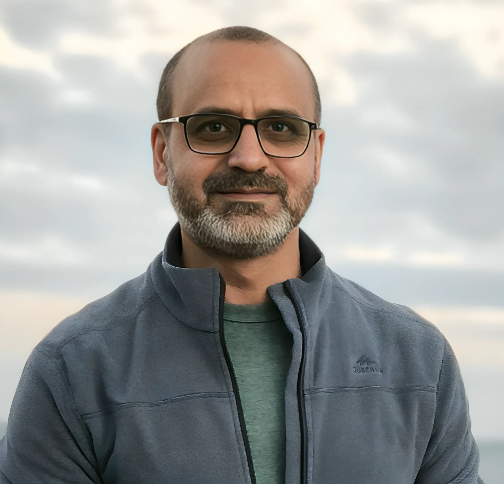

```{=html}
<section class="home-hero" aria-labelledby="home-title">
  <div class="home-hero-copy">
    <div class="eyebrow">Computational biology · Scientific AI</div>
    <h1 id="home-title">Tahir Ali, PhD</h1>
    <p class="hero-role">Evolutionary and computational biologist building trustworthy AI for genomics, research, and scientific learning.</p>
    <p class="hero-copy">I combine population-genomic research, biological domain expertise, and reproducible software engineering to turn complex data into defensible scientific insight.</p>
    <div class="hero-actions">
      <a class="button-primary" href="popgenlm.html">Explore PopGenLM Bench</a>
      <a class="button-secondary" href="genomes-to-ai.html">Follow Genomes to AI</a>
      <a class="button-secondary" href="projects.html">View research</a>
    </div>
    <div class="hero-meta">
      <span>Institute for Plant Sciences · University of Cologne</span>
      <span>Zülpicher Str. 47b · 50674 Cologne · Germany</span>
      <a href="tel:+492214701139">+49 (0)221 470 1139</a>
      <a href="mailto:tali@uni-koeln.de">tali@uni-koeln.de</a>
      <a href="mailto:ali_tahir99@hotmail.com">ali_tahir99@hotmail.com</a>
    </div>
  </div>
  
</section>
```

## Current focus

<p class="section-intro">Two connected strands define my present work: building scientifically testable AI software and documenting the decisions, evidence, and learning behind it.</p>

```{=html}
<div class="focus-grid">
  <article class="focus-card featured">
    <div class="card-kicker">Flagship open-source project</div>
    <h3>PopGenLM Bench</h3>
    <p>A reproducible framework for testing whether genomic language-model variant scores are technically sound and biologically consistent with population-genetic and evolutionary evidence.</p>
    <div class="tag-row">
      <span class="tag">Python</span><span class="tag">GPN</span><span class="tag">PyTorch</span><span class="tag">Population genomics</span>
    </div>
    <div class="card-actions">
      <a class="button-primary" href="popgenlm.html">Explore the project</a>
      <a class="button-secondary" href="https://github.com/tahirali-biomics/popgenlm-bench">View repository</a>
    </div>
  </article>

  <article class="focus-card journal">
    <div class="card-kicker">Engineering journal</div>
    <h3>Genomes to AI</h3>
    <p>An authentic account of becoming a scientific AI engineer - from biological questions and early prototypes to tested software, failed assumptions, and public releases.</p>
    <div class="tag-row">
      <span class="tag">Learning</span><span class="tag">Building</span><span class="tag">Validation</span><span class="tag">Career transition</span>
    </div>
    <div class="card-actions">
      <a class="button-primary" href="genomes-to-ai.html">Read the journal</a>
    </div>
  </article>
</div>
```

## My journey in science: exploring data and complexity

<p class="journey-tagline">Teacher &amp; mentor · Exploring genomes, stories, and change</p>

```{=html}
<section class="story-section">
  <div class="story-copy">
    <p>I am an evolutionary and computational biologist, fascinated by the interplay of genes, environment, and time. My research in temporal genomics, adaptation, phylogeography, and selection seeks to understand how organisms respond to environmental change—how Darwin’s insight into “descent with modification” unfolds in real populations. Much of my work involves decoding genomes across time, tracing the signatures of survival and loss, and unravelling the mysteries of hybridisation genetics. Increasingly, this means integrating population-scale and multi-omic evidence with machine learning and developing reproducible, testable scientific-AI workflows: combining sequence, annotation, environment, phenotype, and evolutionary history to reveal patterns that might otherwise remain hidden. In practice, I write scripts, build pipelines, evaluate models, and shape raw data into defensible scientific insight—turning fragments of code into narratives about resilience, chance, and transformation while keeping every conclusion accountable to biological evidence.</p>

    <p>Equally important to me is teaching and mentoring. My journey as an educator spans more than two decades, from teaching basic college biology to guiding students through the complexities of ecological and evolutionary genomics. Helping students see connections between data and life is one of the most rewarding parts of my career. I see teaching as a way of opening doors: to curiosity, to critical thinking, and to the joy of discovery.</p>

    <p>Beyond science, I draw inspiration from literature, history, and the worlds we build. The psychological depth of Dostoevsky, the vast social panoramas of Tolstoy, the magical realism of Márquez and Grass, and the dramatic flair of Dumas all shape how I think about complexity, transformation, and endurance. Just as genomes are living archives of struggle and adaptation, so too are cities, landscapes, and stories—layered with memory, resilience, and change.</p>

    <p>Outside of research and teaching, I find joy in travel, in wandering through ancient streets, hiking wild trails, or noticing the quiet poetry of everyday life. Whether I am analysing genetic data, guiding students, reading a novel, or exploring a place shaped by centuries, I am drawn to the same questions: how change is inscribed in structure, how diversity emerges, and how the stories—scientific and personal—that we tell shape who we are.</p>
  </div>
</section>

<blockquote class="journey-quote">“The mystery of human existence lies not in just staying alive, but in finding something to live for.”<cite>Fyodor Dostoevsky</cite></blockquote>
```

## Work across scales

<p class="section-intro">My work connects molecular variation, population processes, ecological change, and the software used to study them.</p>

```{=html}
<div class="card-grid">
  <article class="content-card">
    <div class="card-kicker">Research</div>
    <h3>Evolution in natural populations</h3>
    <p>Temporal genomics, hybridisation, climate adaptation, phylogeography, population structure, and genome-scale evidence for drift and selection.</p>
    <div class="card-actions"><a class="button-quiet" href="projects.html">Explore research →</a></div>
  </article>

  <article class="content-card">
    <div class="card-kicker">Scientific software</div>
    <h3>Reproducible genomic analysis</h3>
    <p>Versioned pipelines, quality-control systems, statistical evaluation, interpretable reports, and careful separation of technical success from biological support.</p>
    <div class="card-actions"><a class="button-quiet" href="https://github.com/tahirali-biomics">Browse GitHub →</a></div>
  </article>

  <article class="content-card">
    <div class="card-kicker">Education</div>
    <h3>Interactive biological learning</h3>
    <p>Lecture-grounded course companions, simulations, practical genomics tutorials, and AI-supported feedback designed to preserve instructor control.</p>
    <div class="card-actions"><a class="button-quiet" href="teaching/teaching.html">View teaching resources →</a></div>
  </article>

  <article class="content-card">
    <div class="card-kicker">Translation</div>
    <h3>From evidence to explanation</h3>
    <p>Scientific communication and mentoring that make quantitative biological reasoning clearer without removing its uncertainty or complexity.</p>
    <div class="card-actions"><a class="button-quiet" href="cv.html">View professional profile →</a></div>
  </article>
</div>
```

## Connect and follow

<p class="section-intro">Research outputs, open-source work, professional updates, and shorter reflections across my public profiles.</p>

```{=html}
<div class="social-directory" aria-label="Professional and social profiles">
  <a class="social-profile" href="https://www.linkedin.com/in/tahir-ali-phd-07398823/" aria-label="LinkedIn profile"><i class="bi bi-linkedin" aria-hidden="true"></i><span>LinkedIn</span></a>
  <a class="social-profile" href="https://scholar.google.com/citations?user=3FhH7eMAAAAJ&amp;hl=en" aria-label="Google Scholar profile"><i class="bi bi-mortarboard-fill" aria-hidden="true"></i><span>Google Scholar</span></a>
  <a class="social-profile" href="https://www.researchgate.net/profile/Tahir-Ali-8" aria-label="ResearchGate profile"><span class="social-monogram" aria-hidden="true">RG</span><span>ResearchGate</span></a>
  <a class="social-profile" href="https://github.com/tahirali-biomics" aria-label="GitHub profile"><i class="bi bi-github" aria-hidden="true"></i><span>GitHub</span></a>
  <a class="social-profile" href="https://bsky.app/profile/tahirali-biomics.bsky.social" aria-label="Bluesky profile"><i class="bi bi-cloud" aria-hidden="true"></i><span>Bluesky</span></a>
  <a class="social-profile" href="https://x.com/TahirAli_PhD" aria-label="X profile"><i class="bi bi-twitter-x" aria-hidden="true"></i><span>X</span></a>
  <a class="social-profile" href="https://www.facebook.com/share/1FXBkETf1z/" aria-label="Facebook profile"><i class="bi bi-facebook" aria-hidden="true"></i><span>Facebook</span></a>
</div>
```
