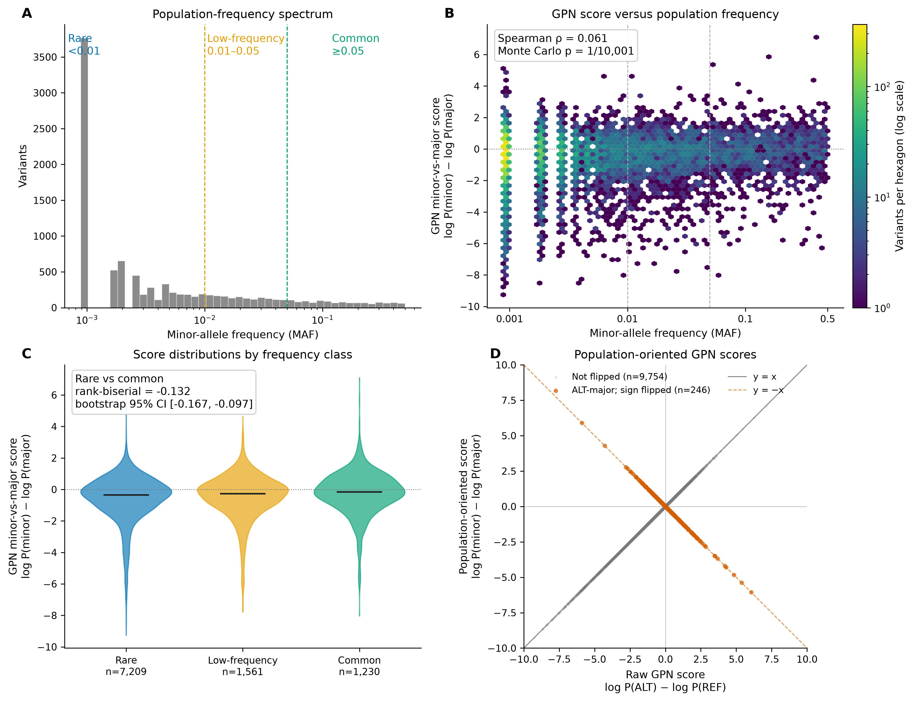

```{=html}
<section class="page-hero popgenlm-hero" aria-labelledby="popgenlm-title">
  <div class="eyebrow">Open-source scientific AI</div>
  <h1 id="popgenlm-title">PopGenLM Bench</h1>
  <p class="lead">A reproducible framework for testing what genomic language-model variant scores mean when they are compared with population-genetic and evolutionary evidence.</p>
  <p class="hero-support">Every model score is treated as a testable hypothesis — not as a biological conclusion.</p>
  <div class="tag-row">
    <span class="status-badge blue">v0.2.0 released</span>
    <span class="tag">Python</span><span class="tag">GPN Brassicales</span><span class="tag">Population genomics</span><span class="tag">Reproducible AI</span><span class="tag">Apache-2.0</span>
  </div>
  <div class="hero-actions">
    <a class="button-primary" href="https://colab.research.google.com/github/tahirali-biomics/popgenlm-bench/blob/v0.2.0/notebooks/popgenlm-bench-v0.2.ipynb">Run v0.2.0 in Colab</a>
    <a class="button-secondary" href="https://github.com/tahirali-biomics/popgenlm-bench/releases/tag/v0.2.0">View v0.2.0 release</a>
    <a class="button-secondary" href="https://github.com/tahirali-biomics/popgenlm-bench">View repository</a>
    <a class="button-secondary" href="posts/2026-08-31-popgenlm-bench/index.html">Read the build note</a>
  </div>
</section>
```

## Why PopGenLM Bench is needed

<p class="lead">Producing a score is an inference step. Establishing what that score means is an evaluation problem.</p>

DNA language models learn statistical regularities from sequence context and can assign scores to large numbers of candidate variants. But a technically valid score is not automatically biological evidence. Before a score is interpreted, its coordinate system, alleles, reference sequence, model revision, orientation, provenance, statistical behaviour, and relationship to independent biological observations need to be checked.

Population and evolutionary genomics provide evidence against which model scores can be evaluated. PopGenLM Bench is designed as the reproducible layer between **model output** and **biological claim**: validate the inputs, preserve inference provenance, orient scores explicitly, quantify associations and uncertainty, and state what the result does — and does not — support.

```{=html}
<div class="validation-stack" aria-label="Validation layers">
  <article><span>01</span><div><h3>Input integrity</h3><p>Genome build, chromosome mapping, coordinates, REF/ALT alleles, duplicates, missingness, and sequence context.</p></div></article>
  <article><span>02</span><div><h3>Inference provenance</h3><p>Model revision, upstream code, packages, parameters, device, inputs, outputs, runtime, and hashes.</p></div></article>
  <article><span>03</span><div><h3>Population orientation</h3><p>Separate raw REF-to-ALT model scores from population minor-vs-major scores so the biological comparison is explicit.</p></div></article>
  <article><span>04</span><div><h3>Biological concordance</h3><p>Test relationships with allele frequency and, in later releases, conservation and genomic context — with effect sizes and interpretation limits.</p></div></article>
</div>
```

## v0.2.0 — population-aware GPN benchmark

```{=html}
<section class="benchmark-summary" aria-label="PopGenLM Bench v0.2.0 summary">
  <div class="benchmark-copy">
    <div class="card-kicker">Current release · September 2026</div>
    <h3>10,000 real <em>Arabidopsis thaliana</em> variants</h3>
    <p>v0.2.0 moves PopGenLM Bench from an engineering fixture to a population-aware benchmark. It uses deterministically selected biallelic SNPs from the 1001 Genomes Project, validates every REF allele against TAIR10.1, combines population summaries with reproducible GPN Brassicales scores, and evaluates the relationship between minor-allele frequency and model score.</p>
  </div>
  <div class="stats-grid benchmark-stats">
    <div class="stat-card"><span class="stat-value">10,000</span><span class="stat-label">population variants</span></div>
    <div class="stat-card"><span class="stat-value">7,209</span><span class="stat-label">rare variants, MAF &lt; 0.01</span></div>
    <div class="stat-card"><span class="stat-value">ρ = 0.061</span><span class="stat-label">MAF × GPN association</span></div>
    <div class="stat-card"><span class="stat-value">−0.132</span><span class="stat-label">rare-vs-common rank-biserial effect</span></div>
  </div>
  <figure class="benchmark-figure">
    
    <figcaption>PopGenLM Bench v0.2.0. Rare variants dominate the benchmark, the MAF–score association is weak, frequency classes overlap substantially, and 246 ALT-major variants require a sign reversal when the raw REF-to-ALT GPN score is oriented as minor versus major.</figcaption>
  </figure>
</section>
```

The primary population-oriented score is

\[
\mathrm{GPN}_{\text{minor vs major}}
=
\log P(\text{minor})-\log P(\text{major}).
\]

Negative values mean that GPN assigns lower sequence likelihood to the population minor allele than to the major allele.

For variants in which ALT is the minor allele, the raw score

\[
\log P(\mathrm{ALT})-\log P(\mathrm{REF})
\]

already has the required orientation. For the **246 ALT-major variants**, the sign is reversed. This transformation makes the population comparison explicit; it does not create the observed genome-wide association.

### Main result

Across the 10,000-variant benchmark:

- **Spearman ρ = 0.0611** between MAF and the GPN minor-vs-major score;
- chromosome-stratified **Monte Carlo p = 1 / 10,001**;
- rare variants have median score **−0.3485**;
- common variants have median score **−0.1562**;
- rare versus common rank-biserial effect = **−0.1322**;
- bootstrap 95% CI = **[−0.1665, −0.0973]**.

The result is therefore **weak but reproducible concordance**, not strong predictive separation. The distributions overlap extensively.

<div class="interpretation-note"><strong>Interpretation boundary:</strong> this result is not evidence that GPN directly predicts natural selection. Population demography, structure, linkage disequilibrium, ascertainment, allele age, and other evolutionary processes may contribute. The chromosome-stratified permutation preserves chromosome membership but does not explicitly model local LD.</div>

### Robustness

The positive association remains under stricter data filters:

| Analysis | n | Spearman ρ |
|---|---:|---:|
| All variants | 10,000 | 0.0611 |
| Call rate ≥ 0.95 | 6,761 | 0.0581 |
| MAC ≥ 5 | 5,057 | 0.0876 |
| Call rate ≥ 0.95 and MAC ≥ 5 | 3,279 | 0.1002 |

The association is also positive separately on chromosomes 1–5 and remains positive after excluding each chromosome in turn. This supports the conclusion that the genome-wide direction is not being driven by a single chromosome.

```{=html}
<div class="link-row">
  <a class="button-primary" href="https://colab.research.google.com/github/tahirali-biomics/popgenlm-bench/blob/v0.2.0/notebooks/popgenlm-bench-v0.2.ipynb">Open v0.2.0 in Colab</a>
  <a class="button-secondary" href="https://github.com/tahirali-biomics/popgenlm-bench/blob/v0.2.0/reports/v0.2/README.md">Read full v0.2.0 report</a>
  <a class="button-secondary" href="https://github.com/tahirali-biomics/popgenlm-bench/releases/tag/v0.2.0">Release notes</a>
  <a class="button-secondary" href="https://github.com/tahirali-biomics/popgenlm-bench/tree/v0.2.0">Browse v0.2.0 source</a>
</div>
```

## v0.2.0 Colab — reproduce the public result

The release notebook is intentionally lightweight. It starts from the frozen population + GPN benchmark rather than rerunning the expensive 10,000-variant GPN inference.

It:

1. downloads the immutable v0.2.0 benchmark artifacts;
2. verifies their SHA256 checksums;
3. validates the 10,000 unique biallelic variant keys and score schema;
4. checks the minor-vs-major orientation, including the 246 sign flips;
5. recomputes the allele-frequency spectrum and the main Spearman association;
6. compares rare, low-frequency, and common variants;
7. visualizes the score-orientation transformation; and
8. loads the frozen sensitivity and chromosome-robustness results.

```{=html}
<div class="colab-panel">
  <div>
    <div class="card-kicker">Current reproducible notebook</div>
    <h3>Population-aware validation without rerunning model inference</h3>
    <p>The notebook is pinned to the v0.2.0 release and can be run directly in Google Colab. It verifies the released artifacts before reproducing the main analysis.</p>
  </div>
  <a class="button-colab" href="https://colab.research.google.com/github/tahirali-biomics/popgenlm-bench/blob/v0.2.0/notebooks/popgenlm-bench-v0.2.ipynb">Open v0.2.0 in Google Colab</a>
</div>
```

## v0.1.0 — reproducible analysis foundation

v0.1.0 remains available as the first frozen PopGenLM Bench analysis fixture. It contains **100 deterministic SNVs with verified GPN scores**, together with the score table, metadata, schema checks, descriptive statistics, bootstrap uncertainty, figures, and a CPU-compatible Colab notebook.

The important distinction is that v0.1.0 is an **engineering and analysis fixture**, not a sampled population benchmark. It established a reproducible analysis path before population-aware evaluation was added in v0.2.0.

```{=html}
<section class="benchmark-summary" aria-label="PopGenLM Bench v0.1.0 summary">
  <div class="benchmark-copy">
    <div class="card-kicker">Archived reproducible foundation</div>
    <h3>100 deterministic variants with verified GPN scores</h3>
    <p>v0.1.0 validates score-table structure, metadata, descriptive analysis, bootstrap uncertainty, and figure generation. It does not by itself support population-genetic or evolutionary claims.</p>
  </div>
  <div class="stats-grid benchmark-stats">
    <div class="stat-card"><span class="stat-value">100</span><span class="stat-label">deterministic SNVs</span></div>
    <div class="stat-card"><span class="stat-value">100</span><span class="stat-label">complete GPN scores</span></div>
    <div class="stat-card"><span class="stat-value">−1.031</span><span class="stat-label">median score</span></div>
    <div class="stat-card"><span class="stat-value">77%</span><span class="stat-label">scores below zero</span></div>
  </div>
  <figure class="benchmark-figure">
    
    <figcaption>v0.1.0 verified analysis fixture. These are model-score summaries for a deterministic engineering dataset, not population-frequency evidence.</figcaption>
  </figure>
</section>
```

<div class="interpretation-note"><strong>v0.1.0 interpretation boundary:</strong> the deterministic 100-variant fixture is not a sampled population. It verifies analysis, schema, provenance, and reporting; it is not evidence for selection, functional constraint, or a population-level effect.</div>

```{=html}
<div class="link-row">
  <a class="button-primary" href="https://colab.research.google.com/github/tahirali-biomics/popgenlm-bench/blob/v0.1.0/notebooks/popgenlm-bench-demo.ipynb">Open v0.1.0 in Colab</a>
  <a class="button-secondary" href="https://github.com/tahirali-biomics/popgenlm-bench/tree/v0.1.0">Browse v0.1.0 source</a>
  <a class="button-secondary" href="assets/popgenlm/gpn-scores-100.tsv">Download v0.1 score table</a>
  <a class="button-secondary" href="assets/popgenlm/summary.json">View v0.1 summary</a>
  <a class="button-secondary" href="assets/popgenlm/run-metadata.json">Inspect v0.1 metadata</a>
</div>
```

## From model score to biological evidence

```{=html}
<div class="evidence-pipeline" role="img" aria-label="PopGenLM Bench evidence pipeline">
  <div class="evidence-node"><span>Input</span><strong>Variants + reference</strong><small>Coordinates, alleles, sequence</small></div>
  <div class="evidence-arrow" aria-hidden="true">→</div>
  <div class="evidence-node"><span>Model</span><strong>Sequence score</strong><small>Explicit score semantics</small></div>
  <div class="evidence-arrow" aria-hidden="true">→</div>
  <div class="evidence-node"><span>Population</span><strong>MAF + orientation</strong><small>Minor versus major allele</small></div>
  <div class="evidence-arrow" aria-hidden="true">→</div>
  <div class="evidence-node accent"><span>Evidence</span><strong>Effect + uncertainty</strong><small>Concordance and limits</small></div>
</div>
```

The central design principle is separation of concerns. Model scoring, reference validation, population orientation, statistical evaluation, and biological interpretation remain distinct steps. This makes failure modes inspectable and helps prevent a model score from being promoted directly into a biological claim.

## Version history and roadmap

<div class="roadmap">
  <div class="roadmap-item"><h3>v0.1.0 · Reproducible analysis foundation · released</h3><p>Frozen 100-variant GPN score fixture, schema and metadata checks, descriptive statistics, bootstrap uncertainty, figures, and CPU-compatible Colab analysis.</p></div>
  <div class="roadmap-item"><h3>v0.2.0 · Population-aware benchmark · released</h3><p>10,000 real 1001 Genomes SNPs, exact TAIR10.1 REF validation, reproducible GPN scores, minor-vs-major orientation, population-frequency evaluation, effect sizes, chromosome-stratified permutation, robustness analyses, figures, tests, CI, and release-pinned Colab.</p></div>
  <div class="roadmap-item"><h3>v0.3 · Evolutionary evidence</h3><p>Add conservation tracks and test model–conservation concordance across genomic contexts, with explicit attention to dependence among nearby variants.</p></div>
  <div class="roadmap-item"><h3>v0.4–0.5 · Extensible researcher beta</h3><p>Stabilize model adapters, support additional model or precomputed-score inputs, expand reporting, add containerized workflows, and test with external users.</p></div>
  <div class="roadmap-item"><h3>v1.0 · Citable release</h3><p>Freeze public schemas, incorporate beta feedback, add end-to-end release checks and case studies, and mint a software DOI.</p></div>
</div>

## Reproduce v0.2.0 locally

The released population analysis can be reproduced from the frozen artifacts without rerunning GPN inference:

```bash
git clone https://github.com/tahirali-biomics/popgenlm-bench.git
cd popgenlm-bench
git checkout v0.2.0

python -m venv .venv
source .venv/bin/activate
python -m pip install --upgrade pip
pip install -e ".[dev,viz]"

pytest -q
ruff check src tests scripts

python scripts/analyze_v02_population_gpn.py
python scripts/plot_v02_population_gpn.py
```

The full v0.2.0 release is validated by **58 automated tests** and GitHub Actions on Python 3.11 and 3.12.

## Public scope

PopGenLM Bench uses public demonstration and benchmark data. It does not contain unpublished *Arabidopsis lyrata* results, restricted teaching sources, student work, private credentials, or institution-owned material without permission.
