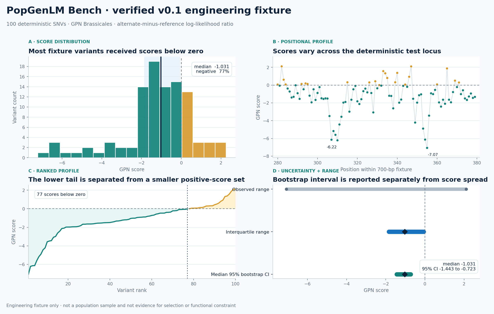

```{=html}
<section class="page-hero popgenlm-hero" aria-labelledby="popgenlm-title">
  <div class="eyebrow">Open-source scientific AI</div>
  <h1 id="popgenlm-title">PopGenLM Bench</h1>
  <p class="lead">A reproducible evaluation framework for determining whether genomic language-model variant scores are technically valid, biologically coherent, and ready to support population-genetic inference.</p>
  <p class="hero-support">The project treats every model score as a testable hypothesis - not as a biological conclusion.</p>
  <div class="tag-row">
    <span class="status-badge blue">v0.1 verified foundation</span>
    <span class="tag">Python</span><span class="tag">GPN Brassicales</span><span class="tag">PyTorch</span><span class="tag">Population genomics</span><span class="tag">Apache-2.0</span>
  </div>
  <div class="hero-actions">
    <a class="button-primary" href="https://github.com/tahirali-biomics/popgenlm-bench">View repository</a>
    <a class="button-colab" href="https://colab.research.google.com/github/tahirali-biomics/tahirali-biomics.github.io/blob/main/notebooks/popgenlm-bench-demo.ipynb">Run verified analysis in Colab</a>
    <a class="button-secondary" href="notebooks/popgenlm-bench-demo.ipynb">Download notebook</a>
    <a class="button-secondary" href="posts/2026-08-31-popgenlm-bench/index.html">Read the build note</a>
  </div>
</section>
```

## Why PopGenLM Bench is needed

<p class="lead">Producing a score is an inference step. Establishing what that score means is an evaluation problem.</p>

DNA language models learn statistical regularities from sequence context and can score millions of candidate variants. That scale is powerful, but it also creates a new risk: technically plausible outputs can travel quickly into downstream analyses before their coordinate system, alleles, model revision, orientation, calibration, or biological interpretation has been checked.

Population and evolutionary genomics provide independent evidence against which those scores can be examined. If a model captures aspects of functional constraint, its predictions should show interpretable relationships with allele frequency, phylogenetic conservation, genomic annotation, and other external measures - while respecting demography, linkage, ascertainment, and uncertainty. PopGenLM Bench is being built as the reproducible layer between **model output** and **biological claim**.

```{=html}
<div class="validation-stack" aria-label="Validation layers">
  <article><span>01</span><div><h3>Input integrity</h3><p>Genome build, chromosome naming, coordinates, REF/ALT alleles, duplicates, missingness, and sequence orientation.</p></div></article>
  <article><span>02</span><div><h3>Inference provenance</h3><p>Exact model and code revisions, packages, device, command, parameters, hashes, runtime, and failure state.</p></div></article>
  <article><span>03</span><div><h3>Statistical behaviour</h3><p>Distributions, effect sizes, uncertainty intervals, resampling, stratification, and sensitivity to analytical choices.</p></div></article>
  <article><span>04</span><div><h3>Biological concordance</h3><p>Allele frequency, conservation, annotation class, genomic context, and explicit limits on evolutionary interpretation.</p></div></article>
</div>
```

## Verified v0.1 benchmark

```{=html}
<section class="benchmark-summary" aria-label="Verified benchmark summary">
  <div class="benchmark-copy">
    <div class="card-kicker">First reproducible end-to-end run</div>
    <h3>100 deterministic SNVs scored with a pinned published model</h3>
    <p>The GPN Brassicales workflow completed every variant with strict reference checking, forward/reverse-complement scoring, fixed model and code revisions, and complete run metadata. The benchmark is intentionally small: it verifies the engineering path before population-scale biological claims are introduced.</p>
  </div>
  <div class="stats-grid benchmark-stats">
    <div class="stat-card"><span class="stat-value">100</span><span class="stat-label">complete variant scores</span></div>
    <div class="stat-card"><span class="stat-value">80.7 s</span><span class="stat-label">verified CPU runtime</span></div>
    <div class="stat-card"><span class="stat-value">-1.031</span><span class="stat-label">median model score</span></div>
    <div class="stat-card"><span class="stat-value">77%</span><span class="stat-label">scores below zero</span></div>
  </div>
  <figure class="benchmark-figure">
    
    <figcaption>Verified 100-variant engineering fixture. The panels show the score distribution, positional behaviour across the test locus, and ranked score profile using the same underlying result table.</figcaption>
  </figure>
</section>
```

<div class="interpretation-note"><strong>Interpretation boundary:</strong> this deterministic fixture is not a sampled population. It verifies data flow, scoring, provenance, and reporting; it is not evidence for selection, functional constraint, or a population-level effect.</div>

<div class="link-row">
  <a class="button-secondary" href="assets/popgenlm/gpn-scores-100.tsv">Download score table</a>
  <a class="button-secondary" href="assets/popgenlm/summary.json">View statistical summary</a>
  <a class="button-secondary" href="assets/popgenlm/run-metadata.json">Inspect run metadata</a>
</div>

## From model score to population-genetic evidence

```{=html}
<div class="evidence-pipeline" role="img" aria-label="PopGenLM Bench evidence pipeline">
  <div class="evidence-node"><span>Input</span><strong>VCF / TSV + reference</strong><small>Coordinates and alleles</small></div>
  <div class="evidence-arrow" aria-hidden="true">→</div>
  <div class="evidence-node"><span>Model</span><strong>Sequence likelihood</strong><small>Pinned inference adapter</small></div>
  <div class="evidence-arrow" aria-hidden="true">→</div>
  <div class="evidence-node"><span>Evidence</span><strong>Frequency + conservation</strong><small>Independent biological signals</small></div>
  <div class="evidence-arrow" aria-hidden="true">→</div>
  <div class="evidence-node accent"><span>Report</span><strong>Effect + uncertainty</strong><small>Reproducible interpretation</small></div>
</div>
```

The central design principle is separation of concerns. A model adapter produces scores; validation checks whether inputs and outputs are internally consistent; evaluation modules test relationships with independent evidence; and the report states both the supported result and its boundary. This makes it possible to compare models without hiding model-specific assumptions inside the biological analysis.

## A working Colab analysis

The associated notebook is included in this website repository and is designed to run in a clean Google Colab session. It does not depend on unpublished data or a local directory. The notebook:

1. loads the verified public fixture, with an embedded fallback so the analysis remains reproducible;
2. validates the required columns and allele representation;
3. recalculates descriptive statistics and the bootstrap confidence interval for the median;
4. recreates the benchmark figure at publication quality;
5. accepts a compatible uploaded score table for the same quality-control and summary workflow; and
6. exports the checked table, summary JSON, and figure.

<div class="colab-panel">
  <div><div class="card-kicker">No local installation required</div><h3>Inspect the result, rerun the statistics, or analyse a compatible score table</h3><p>GPU access is not required for this verified analysis notebook. A later inference notebook will use a Colab GPU for full model scoring once the public package and model adapter are released.</p></div>
  <a class="button-colab" href="https://colab.research.google.com/github/tahirali-biomics/tahirali-biomics.github.io/blob/main/notebooks/popgenlm-bench-demo.ipynb">Open in Google Colab</a>
</div>

## What v0.1 establishes

<div class="principle-grid">
  <article class="principle-card"><h3>Reference safety</h3><p>Coordinates and reference alleles are checked against the supplied FASTA before inference begins.</p></article>
  <article class="principle-card"><h3>Versioned inference</h3><p>Model, upstream code, packages, device, command, runtime, inputs, outputs, and hashes are recorded.</p></article>
  <article class="principle-card"><h3>Inspectable outputs</h3><p>Raw and merged scores, summary statistics, figures, and metadata remain available for review and reuse.</p></article>
  <article class="principle-card"><h3>Scientific restraint</h3><p>Reports distinguish technical completion from population-genetic support and evolutionary interpretation.</p></article>
</div>

## Development roadmap

<div class="roadmap">
  <div class="roadmap-item"><h3>v0.1 · Reproducible inference foundation</h3><p>Package structure, CLI, strict allele validation, pinned GPN inference, tests, CI, metadata, Colab analysis, and the verified fixture.</p></div>
  <div class="roadmap-item"><h3>v0.2 · Public population benchmark</h3><p>Add a documented public <em>Arabidopsis thaliana</em> population dataset, allele-frequency evaluation, effect sizes, block-bootstrap intervals, and permutation tests.</p></div>
  <div class="roadmap-item"><h3>v0.3 · Evolutionary evidence</h3><p>Integrate conservation tracks and compare model-conservation agreement across genomic annotation classes.</p></div>
  <div class="roadmap-item"><h3>v0.4-0.5 · Extensible researcher beta</h3><p>Add a stable model-adapter protocol, a second model or precomputed-score adapter, container support, fuller documentation, and external beta users.</p></div>
  <div class="roadmap-item"><h3>v1.0 · Citable release</h3><p>Freeze public schemas, resolve beta feedback, add end-to-end tests, publish case studies, and mint a software DOI.</p></div>
</div>

## Reproduce the first run

```bash
git clone https://github.com/tahirali-biomics/popgenlm-bench.git
cd popgenlm-bench
uv python install 3.13
uv sync --extra gpn --group dev
uv run popgenlm demo --project-root .
```

Fast unit tests are designed not to require model-weight downloads or a GPU. The verified inference also runs on CPU; GPU acceleration becomes valuable when the benchmark expands to population-scale variant sets and multiple model adapters.

## Public scope

PopGenLM Bench uses public demonstration data. It does not contain unpublished *Arabidopsis lyrata* results, restricted teaching sources, student work, private credentials, or institution-owned material without permission.
