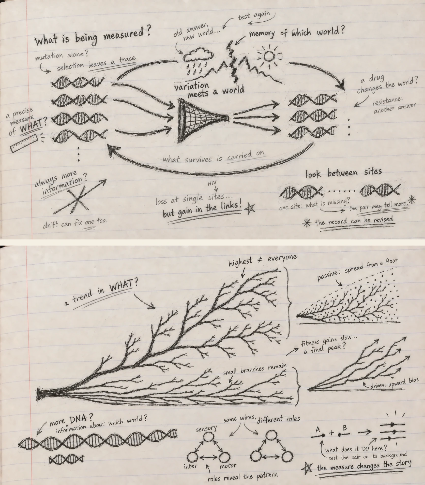

*Reading Christoph Adami, **The Evolution of Biological Information**, Chapter 1.*

I thought Chapter 1 would feel like familiar ground.

Inheritance. Mutation. Selection. Species. Darwin.

The vocabulary is so deeply embedded in biology that I almost expected to move through the chapter quickly, collecting definitions on the way to the more difficult material.

Instead, I got stuck on a deceptively simple question:

> **What has to be true before evolution can do anything at all?**

Not before adaptation becomes impressive.

Not before complexity appears.

Before evolution can even begin to accumulate a history.

The answer sounds almost too elementary:

**something must be copied, something must vary, and those differences must matter for what gets copied next.**

I knew all three pieces.

What I had not been thinking about carefully enough was why none of them is evolution on its own.

That became the thread I followed through the chapter.

## Copying is more interesting than inheritance

We usually introduce inheritance from the outside.

Offspring resemble parents.

Traits run in families.

Characters persist across generations.

But Adami immediately pushes the idea one level deeper. The mechanistic core of inheritance is **replication**—and, more abstractly still, the copying of information.

That small shift changed the picture for me.

The evolutionary object is not simply a visible trait being passed forward. Something encoded has to survive the transition from one generation to the next with enough fidelity that a lineage has continuity.

So copying is the conservative side of evolution.

It keeps yesterday from disappearing.

And then the first paradox appears.

Perfect copying sounds ideal.

For preservation, it is.

For evolution, it is a dead end.

If every copy were exact forever, the population could preserve what it already knows, but it could never discover anything new.

I wrote in the margin:

> **perfect memory, no exploration**

That feels like a useful way to think about inheritance.

Evolution needs memory.

But not perfect memory.

## Mutation is not only a mistake

The natural next move is to call mutation an error.

That is physically reasonable. Replication happens in a noisy material world. Molecules are copied by imperfect machinery. Bases are substituted. Segments are inserted, deleted, duplicated, inverted or shuffled. Recombination creates still more combinations.

From the perspective of the copied sequence, these are departures from fidelity.

But from the perspective of evolution, something more interesting is happening.

Mutation creates alternatives.

And without alternatives, selection has nothing to compare.

This made me notice an asymmetry that I had stopped seeing because it is so familiar:

**replication protects existing information; mutation risks it.**

Yet evolution needs both.

Too much instability and the lineage cannot retain successful solutions.

Too much fidelity and it cannot search beyond them.

That is already a much richer picture than “mutation introduces variation”.

The genome is being held between two requirements:

**remember enough to persist; change enough to explore.**

I suspect I will keep coming back to that tension throughout the book.

## But variation alone knows nothing about where to go

At this point another question appeared.

If mutation creates possibilities, does mutation create adaptation?

No.

Variation is blind to whether a new state is useful.

A mutation can be beneficial, neutral, deleterious or lethal only relative to a biological context in which its consequences are expressed.

So the mutation itself is not the answer.

It is a proposal.

The environment—and the population living in it—determines what happens next.

That makes the familiar phrase *variation meets selection* feel slightly misleading to me now.

What variation really meets is a **world**.

And only through that encounter does a difference acquire an evolutionary consequence.

## Fitness is not “who happened to survive”

The chapter then pauses over fitness, and this was more useful than I expected.

“Survival of the fittest” is one of those phrases that becomes less helpful the more casually it is repeated.

If the survivor is defined as the fittest and the fittest is defined as the survivor, the phrase collapses into a circle.

But that is not how fitness works.

Fitness is an expectation about reproductive success associated with a lineage or genotype—not a guarantee about the fate of one individual.

That distinction matters because chance never disappears.

A member of a high-fitness lineage can die before reproducing.

A member of a lower-fitness lineage can get lucky.

Realized survival is noisy.

Expected reproductive success is the population-level quantity selection acts through.

I found myself thinking of it this way:

> **fitness is a tendency; survival is an outcome**

They are related, but they are not identical.

That one distinction already protects us from a surprising amount of sloppy evolutionary reasoning.

It also makes selection less mysterious.

Selection does not need foresight.

It does not inspect organisms and reward the “best”.

If heritable differences systematically alter expected reproductive success, frequencies change.

That is enough.

## Then the chapter performs the cleanest possible experiment

This was probably my favourite part of Chapter 1.

Adami constructs an intentionally simple population of sequences on an intentionally simple fitness landscape.

The model is not trying to imitate a real organism.

That is exactly why it is useful.

It lets us ask a sharper question:

> **Which pieces of the Darwinian mechanism are actually necessary?**

With replication, mutation and selection all operating, the population can move through sequence space toward the defined optimum.

Then one ingredient is removed at a time.

### No mutation

There is still selection.

There is still reproduction.

The best sequence already present can spread.

Mean fitness rises for a while.

But once the initial variation has been sorted, nothing genuinely new can appear.

The population has climbed as far as its starting material allows.

Then evolution stalls.

Selection can amplify an existing answer.

It cannot invent the next one.

### No reproduction

Mutation still produces new sequences.

A fitness ranking still exists.

But there is no mechanism by which successful sequences leave more descendants.

The system can wander.

It cannot build a lineage of accumulated improvements.

A discovery that is not preferentially copied is evolutionarily ephemeral.

### No selection

Replication continues.

Mutation continues.

The population still changes.

Some variants can even become common by chance.

But the relationship between sequence and the defined environment no longer directs the change.

There is motion without adaptive direction.

And suddenly the Darwinian triad stops feeling like three items in a textbook list.

It feels like a machine.

Remove one gear and the behaviour changes qualitatively.

I wrote:

> **copying preserves  
> mutation opens  
> selection filters**

But even that is slightly incomplete.

The real point is that the three only become evolution **together**.

{fig-alt="Graphite notebook-style reading notes on lined paper, with hand-drawn DNA, evolutionary branching, questions about measurement, information, fitness, selection, and the distinction between passive and driven evolutionary trends."}

## A strange detail in the toy model points toward the rest of the book

The simulation is deliberately simple enough that mutations contribute independently to fitness.

That means the order in which beneficial changes occur does not matter very much.

Real biology is not like that.

The effect of one mutation can depend on what is already present elsewhere in the genome.

Adami flags this immediately: once mutations interact—once **epistasis** enters—the landscape becomes enormously richer.

I liked that the chapter tells us, in effect:

*Here is evolution with much of the interesting difficulty temporarily removed.*

That is good modelling.

Strip the system down until the mechanism becomes visible.

Then put the complexity back.

It also made me think about how easily we confuse a useful simplification with a biological claim.

A model can be intentionally unrealistic and still teach us something true.

The danger begins when we forget which part was deliberately left out.

That thought will matter later when I get to genomic AI.

## Species are not another ingredient

I had another small conceptual correction when the chapter turned to speciation.

Species are central to Darwin’s title.

But speciation is not a fourth element added beside inheritance, variation and selection.

It is an **outcome** that can emerge when those processes operate through time in structured populations.

That distinction is important.

A population can be split geographically.

Gene flow can be interrupted.

Independent histories accumulate.

Eventually the difference can become biological rather than merely geographic.

Or populations can begin diverging while occupying the same broader region, particularly when ecological specialization and mate choice reduce gene exchange.

For asexual organisms the details change again.

And ecology becomes unavoidable.

If every beneficial mutation in an asexual population simply replaced what came before, why would so many lineages coexist?

Because organisms need not compete for exactly the same resource in exactly the same way.

Different niches can sustain different solutions.

So by the time the chapter reaches species, the neat three-part mechanism has already opened into something larger:

**population structure, gene flow, competition, resources, frequency dependence, ecology.**

The Darwinian minimum is simple.

Its consequences are not.

## Then the chapter does something I did not expect: it asks why this took so long to see

The historical half initially felt like a change of subject.

It was not.

In fact, it may be the part that made the first half more vivid.

Today, evolution is so conceptually normal that the Darwinian mechanism can feel almost inevitable.

But that feeling is an illusion produced by hindsight.

Before Darwin’s synthesis could become possible, the intellectual world itself had to change.

Life had to become something that could be classified systematically.

Extinction had to become believable.

The Earth had to become old.

Species had to become mutable.

Fossils had to become records of lost worlds rather than curiosities.

Geology had to show that enormous transformations could emerge from ordinary processes acting for immense periods of time.

Population growth had to be placed against finite resources.

And the old image of nature as a fixed ladder had to break.

That last point stayed with me.

A ladder gives every organism a preassigned place.

A tree gives every lineage a history.

Those are not just different diagrams.

They are different ways of thinking about life.

## The people before Darwin were not simply “wrong”

I also liked that the history is messier than the usual compressed story.

Linnaeus helped make biological diversity legible through classification even while working within a largely fixed view of species.

De Maillet, Buffon and Erasmus Darwin entertained transformation and a much more dynamic natural world.

Malthus sharpened the consequence of reproduction under limited resources.

Lamarck was wrong about the inheritance mechanism he emphasized, but he was not wrong to take species change seriously.

Cuvier’s comparative anatomy and fossils made extinction difficult to ignore even though he did not embrace Darwinian transformation.

Lyell supplied deep geological time and the power of ordinary processes.

Wallace independently reached natural selection from observations of variation, geography and resources.

Seen this way, Darwin did not walk into an empty room and switch on the light.

The room had been filling with pieces for a long time.

His achievement was to connect them into a mechanism powerful enough to reorganize biology.

That gave me another margin note:

> **sometimes the breakthrough is not a new fact—it is a new relationship among facts already present**

That sentence feels very relevant to scientific AI too.

## A deeper question: what exactly is the environment writing into the genome?

Near the end of the mechanistic discussion, Adami makes a move that points toward the rest of the book.

A well-adapted organism can be thought of as carrying information about its environment in its genes.

I find that formulation both exciting and dangerous.

Exciting, because it gives adaptation a quantitative direction.

Dangerous, because it is easy to turn “information about the environment” into a metaphor and stop there.

So I found myself asking:

**What exactly has been written?**

A genome does not contain a literal description of temperature, predators, nutrients or mates.

What it contains are sequence states whose consequences have repeatedly survived encounters with those conditions.

That is a very different kind of knowledge.

It is knowledge encoded through differential persistence.

The genome does not *describe* the environment.

It bears traces of what has worked in it.

And those traces are always conditional on history.

Change the environment and yesterday’s information can become irrelevant—or harmful.

That makes biological information feel less like a stored encyclopedia and more like a compressed record of successful interactions.

## This is where I began thinking about genomic language models

Up to this point I had been reading as an evolutionary biologist.

Then the AI connection became difficult to ignore.

A genomic language model is trained on sequence.

But the sequence corpus itself is not raw nature.

It is already an evolutionary product.

Every extant genome is a survivor of copying, mutation, selection, drift, demography, extinction and historical contingency.

That means the model is not merely learning “DNA”.

It is learning patterns from an **archive produced by evolution**.

That sounds powerful.

It is.

But it creates a difficult interpretive problem.

A pattern can be present in the archive for many reasons.

Constraint.

Mutation bias.

GC-biased gene conversion.

Demographic history.

Linkage.

Recombination.

Phylogenetic relatedness.

Selection.

Chance.

The model may learn the pattern beautifully without knowing which process produced it.

And that led me to a question I want to carry into PopGenLM Bench:

> **Can a model learn the evolutionary trace without learning the evolutionary cause?**

Almost certainly, yes.

That is not a criticism.

It is a reminder to be precise about what a sequence model score means.

## A high-confidence prediction is not yet an evolutionary explanation

Suppose a model strongly prefers one allele over another.

That may be useful.

But what does the preference correspond to?

Is the alternative allele rare because it disrupts molecular function?

Because the local sequence context is unusual?

Because related species share the reference state?

Because the region is mutation-poor?

Because selection has repeatedly removed similar changes?

Because the training data overrepresent one lineage?

The score itself does not answer those questions.

And Chapter 1 gives me a simple reason why.

Evolution is not a property of one sequence in isolation.

It is a process involving **replication, variation and differential propagation through populations and environments**.

A language model can learn the residue left by that process.

Whether it has learned the process itself is a much harder claim.

That distinction feels important enough to state plainly:

> **prediction from evolutionary output is not the same as modelling evolutionary dynamics**

The two can be related.

They are not interchangeable.

## Maybe the right comparison is not genome versus model, but process versus representation

This chapter also made me rethink what I want from an AI model in science.

I do not need a genomic language model to reproduce evolution internally in order for it to be useful.

That would be an unreasonable standard.

But I do need to know which aspects of evolutionary structure its representation preserves.

Does it recover constrained positions?

Does it capture dependencies among sites?

Do its variant scores track allele frequency?

Do its local sequence landscapes correspond to experimentally measured mutational tolerance?

Are its predictions stable across ancestry, species and genomic background?

Where does agreement break down?

Those are empirical questions.

And that is where the analogy with Adami’s toy simulation becomes useful.

The simulation is valuable because its assumptions are explicit and the consequences can be tested by removing components.

A scientific AI model should be treated with the same discipline.

What information was available to it?

What structure did it learn?

What biological evidence does that structure predict?

What disappears when context is removed?

What conclusion would falsify my interpretation of the score?

That is much more interesting to me than simply asking whether the model is “accurate”.

## Perhaps the most important thing Chapter 1 removes is inevitability

There is another idea underneath the whole chapter that I nearly missed.

Evolution produces astonishing adaptation.

Once we see the finished organism, it is tempting to read the outcome backward as though it had been waiting to happen.

But the mechanism contains no such promise.

Variation has to arise.

It has to be heritable.

Its effect has to matter in that environment.

Selection has to be strong enough relative to stochastic forces.

The population has to persist long enough.

Historical paths constrain what becomes reachable next.

Species branch.

Some lineages disappear.

Many alternatives are never explored.

So the Darwinian mechanism is powerful without being prophetic.

It can generate extraordinary fit without containing a blueprint of the destination.

That is refreshing because it changes the emotional tone of adaptation.

The marvel is not that evolution knew where to go.

The marvel is that **a process with no foresight can accumulate structure that looks as though it had one**.

## The sentence I am carrying out of Chapter 1

I started the chapter with three familiar words:

inheritance, variation, selection.

I am leaving it with a different picture.

A lineage needs enough fidelity to remember.

Enough error to explore.

And a world that makes some inherited differences matter more than others.

From that interaction, populations can accumulate adaptation.

From populations come divergence, ecological specialization and species.

Across deep time, those processes leave structured traces in genomes.

And those genomes are now becoming the training material for our models.

So the question I want to keep at the edge of every later chapter is not simply:

**what pattern is in the DNA?**

It is:

> **What evolutionary process could have written that pattern there—and what part of that history can a model actually recover?**

That feels like a better starting point for *Genomes to AI*.

Before asking whether an AI can read the genome, Chapter 1 has made me ask something more fundamental:

**what had to happen before there was anything in the genome worth reading?**
