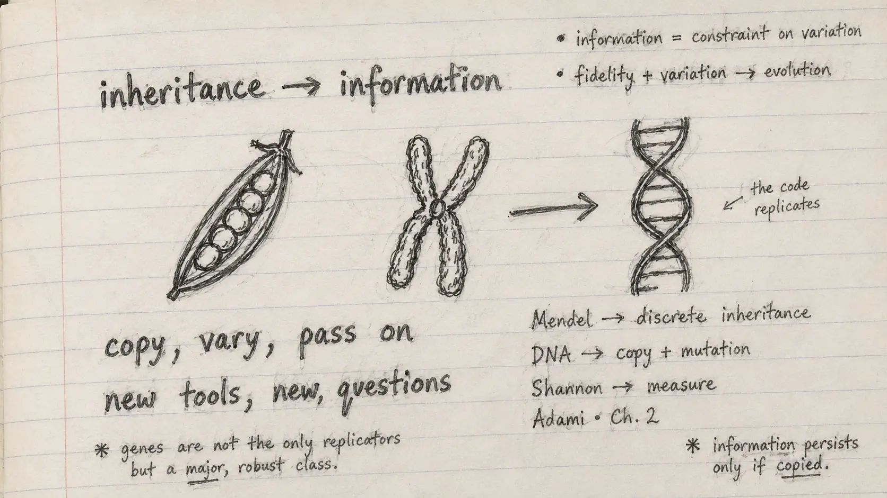

{.reading-sketch fig-alt="Handwritten pencil notes connect inheritance, copying and new scientific questions."}

This fortnight I began Chapter 2, “Information Theory in Biology,” from Christoph Adami's *The Evolution of Biological Information*. I expected a mathematical introduction. What surprised me first was the history. Before information could be measured, biologists had to learn how to see heredity as something separable, locatable, copyable and changeable.

That history made the chapter feel immediately connected to my own journey. Genomics can appear to begin with sequencing machines and large files, but its deeper foundations were built through a sequence of conceptual steps. Each step changed not only what scientists knew, but what they believed could be asked.

## What I learned from the opening section

The chapter begins with a strong reductionist claim: life on Earth is organised through information. This is not simply the familiar metaphor of DNA as a “book.” The important point is operational. DNA can be copied, altered and inherited. Its molecular structure links continuity with variation, so the same mechanism that preserves biological organisation also makes evolution possible.

This changed how I thought about the word *information*. In ordinary conversation, information is often treated as meaningful content. In this chapter, the more useful starting point is prediction. A biological pattern carries information when knowing it improves what we can predict about another state: a nucleotide, a structure, a function or an environment.

The chapter then asks deceptively simple questions. How much information is present in a genome? How much is shared by two organisms? How much is gained through adaptation, transmitted between generations or lost through extinction? These questions are easy to state and very difficult to answer because they require an explicit comparison, a defined set of possible states and enough observations to estimate probabilities.

## The historical path: from character to code

Box 2.1 traces the emergence of genetic information through several distinct advances.

Mendel showed that inherited characters behave as if discrete factors pass between generations. Bateson and Saunders helped establish that these units can occupy alternative states—what we now call alleles. Johannsen separated the inherited unit from its visible expression and gave us the term *gene*. Morgan, Sturtevant and Bridges then placed genes in a linear order on chromosomes, turning heredity into something that could be mapped.

The next steps connected location with mechanism. Mutations showed that changing a chromosomal position could alter or destroy function. Work on gene action linked hereditary material to protein production. The genetic code then made the relationship between nucleotide sequence and amino-acid sequence experimentally legible. By this point, biological molecules could be treated as messages drawn from a space of possible messages—a perspective that made Shannon's mathematical theory relevant to biology.

What I find most important is that no single discovery created “biological information.” The idea became possible only after inheritance, physical location, copying, mutation, expression and coding had been separated and then reconnected.

::: {.pencil-margin-note}
### Notes from my margin

- A new instrument is valuable when it opens a better question.
- Copying explains continuity; mutation makes history possible.
- “Information” becomes scientific only after I say what it predicts.
:::

## My interpretation

The history in this section is a warning against treating scientific AI as a sudden replacement for earlier biology. AI belongs to the same longer progression. Natural history organised variation; genetics formalised inheritance; molecular biology identified a physical code; sequencing made that code observable at scale; bioinformatics made large collections analysable. AI may help us detect structure across those collections, but it does not remove the need to define the biological states, comparisons and evidence.

This matters because an impressive prediction can still be scientifically empty. If I cannot say what a model output is information *about*, which observations support it, or under what conditions it fails, then I have a number rather than knowledge.

I also see a connection with temporal genomics. A genome sampled at one date is a record, but a series of genomes sampled through time lets us ask what was retained, altered or lost. The value lies not in the sequence alone; it lies in the comparison that makes change visible.

## Where I want to learn next

My next steps are to understand three transitions more deeply:

1. How probability turns biological variation into a measurable ensemble.
2. How Shannon entropy separates uncertainty from information.
3. How evolutionary processes create the correlations that allow genomes to carry evidence about environments.

I also want to revisit the history of the genetic code and chromosome mapping—not as a list of discoveries, but as examples of how measurement changes explanation.

## A simple commentary on the chapter so far

Adami's presentation is mathematical, but the opening argument is philosophical in the best scientific sense. It asks what we mean when we say that life contains information, and then refuses to leave the term vague. My main lesson is that biological information is not a substance hidden inside DNA. It is a measurable relationship made visible by a carefully defined question.

That is a demanding standard. It is also a useful one for the AI systems I want to build.

::: {.reading-source}
**Reading for this note:** Christoph Adami, *The Evolution of Biological Information*, Chapter 2, opening discussion and Box 2.1, “The Emergence of the Concept of Genetic Information.” This article is my own synthesis and commentary on the supplied chapter excerpt.
:::
