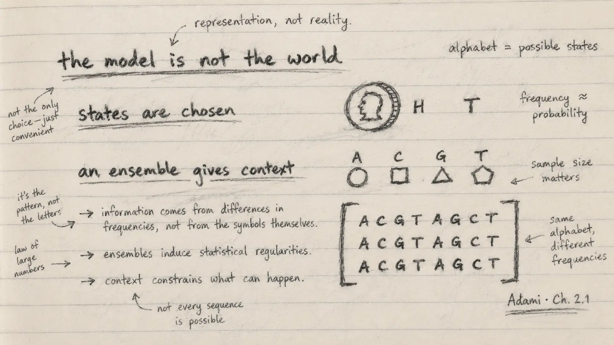

{.reading-sketch fig-alt="Handwritten pencil notes say that a model is not the world, states are chosen and an ensemble gives context."}

During the last two weeks I worked through Section 2.1 on random variables and probabilities. The mathematics begins with familiar objects—a coin, possible outcomes and their frequencies—but the biological lesson is deeper: before measuring uncertainty, I must decide what counts as a possible state.

That decision is part of the model. It is not given automatically by nature.

## Random variables are descriptions

A discrete random variable has a finite set of states, often called an alphabet, and a probability for each state. A coin can be represented by two states; a nucleotide site by A, C, G and T; an amino-acid site by twenty possibilities.

The chapter insists on a distinction I find extremely useful: the random variable is not the physical object. A real coin has material, orientation, wear and many possible behaviours. The two-state model keeps only the distinction needed for a particular question. Even “heads” and “tails” are choices made by an observer using a particular measurement.

The same is true in genomics. A site may be represented as four nucleotides, but an analysis may also need a gap, an unresolved base, methylation state, genotype uncertainty or structural context. The alphabet depends on the biological question and the measurement system. If I change that representation, I may change the probabilities and therefore the information I calculate.

This is not a weakness of modelling. It is why transparent modelling matters.

## Probabilities come from finite observations

For a physical system, probabilities are usually estimated from repeated observations. With a finite sample, frequency is only an approximation to the underlying probability. This obvious fact becomes easy to forget when software prints many decimal places.

The chapter illustrates several ways to treat a DNA sequence. A complete sequence of length (L) can be one state among (4^L) possibilities. Alternatively, its (L) positions can be treated as repeated observations of one nucleotide variable, allowing an estimate of overall base composition. A third approach treats each position as its own variable and uses an alignment of related sequences to estimate site-specific probabilities.

These views use the same letters but answer different questions.

Overall nucleotide frequencies can reveal GC or AT bias. Such bias may have biochemical consequences, but it does not have a single guaranteed evolutionary cause. A site-wise ensemble adds another layer: strongly conserved positions may indicate functional constraint, whereas variable positions may tolerate change. Yet this interpretation depends on alignment quality, sampling and evolutionary history.

## Why the ensemble matters

An ensemble is the collection from which observations are drawn. For a genomic site, an alignment of homologous sequences can provide that collection. Across the alignment, each position becomes a distribution rather than a single letter.

The tRNA example in the chapter makes this concrete. Some positions vary, while others are nearly or completely conserved because the molecule's structure and function constrain acceptable changes. Gaps and unresolved characters must also be treated explicitly; ignoring how they enter the alphabet can alter the analysis.

For me, this is the bridge from a sequence as an object to a sequence as evidence. One string shows what occurred once. An ensemble begins to show what could vary, what repeatedly remains, and how uncertain those conclusions are.

::: {.pencil-margin-note}
### Notes from my margin

- Every dataset has an alphabet, even when it is not written down.
- More decimal places do not create more observations.
- A single sequence is a record; an ensemble makes variation measurable.
:::

## My interpretation for genomic AI

This section immediately changes how I think about model inputs. Tokenisation, genome build, strand orientation, reference allele, treatment of missing bases and sampling population are not preliminary details. They define the states the system is allowed to see.

A DNA language model also learns from an ensemble—its training data. If that ensemble represents some species, regions or sequence contexts much better than others, the model's apparent confidence may exceed the evidence available for a new organism. Before evaluating a score, I therefore need to ask: what alphabet did the model use, what ensemble shaped its probabilities, and how closely does my new dataset match that world?

This is one reason PopGenLM Bench must begin with reference validation and provenance rather than a plot. A biologically incorrect representation can pass through perfectly functioning code.

## Where I want to learn next

I want to connect this section to practical methods for:

- quantifying finite-sample uncertainty in nucleotide frequencies;
- weighting related sequences so that a large clade is not mistaken for many independent observations;
- handling gaps and ambiguous states in alignments;
- comparing frequentist estimates with Bayesian probability models; and
- measuring how training-set composition affects transfer across species.

## My commentary

The most thought-provoking lesson was not a formula. It was the reminder that measurement begins with an agreement about distinctions. Biology is richer than any alphabet we impose on it. Good science does not pretend otherwise; it states the simplification, tests its consequences and changes it when the question demands more.

::: {.reading-source}
**Reading for this note:** Christoph Adami, *The Evolution of Biological Information*, Chapter 2, Section 2.1, from random variables and finite probability estimates through nucleotide composition, site-specific variables and the tRNA alignment.
:::
