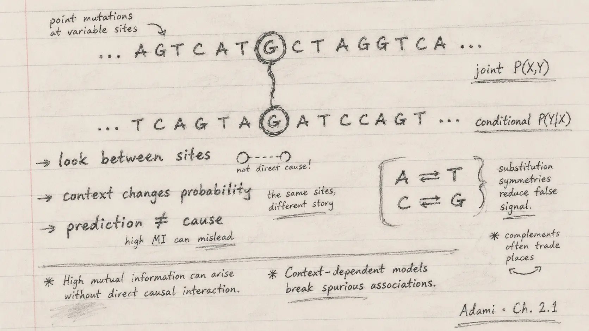

{.reading-sketch fig-alt="Handwritten pencil notes emphasise relationships between sites, context-dependent probability and the difference between prediction and cause."}

This fortnight the chapter moved from individual variables to relationships. That shift felt important. A nucleotide can be common, rare, conserved or variable on its own, but biological structure often appears only when I ask how one position changes with another.

The central idea is simple: context changes probability.

## Joint probability: seeing states together

Two variables can be combined into a joint variable. For nucleotide sites, this means counting pairs such as AA, AC or GT across an alignment. The joint distribution records how often two states occur together. By summing over one variable, we recover the marginal distribution of the other.

The language can sound abstract, but the biological question is direct: do two positions vary independently, or are some combinations favoured and others avoided?

If two coins are independent, learning the outcome of one does not change what I expect from the other. If their outcomes are linked, that knowledge changes the probability. The same logic applies to two sites in a molecule.

## Conditional probability: what changes after I know more?

Conditional probability asks for the distribution of one variable after the state of another is known. It is the formal version of an “if-then” question. Bayes' theorem relates alternative directions of that conditioning.

What I found especially useful is the chapter's caution that conditional dependence does not by itself establish causation. A site can predict another because of physical pairing, shared ancestry, selection, population structure or an unmeasured third factor. Prediction is scientifically valuable, but explanation requires more evidence.

In the tRNA alignment, knowing the nucleotide at one site changes the expected distribution at another. For one pair the prediction is partial. For another pair, the relationship is almost deterministic and reflects complementary base pairing. Sequence statistics therefore reveal something not obvious from either site considered alone: a structural relationship in the molecule.

## From letters to organisation

This example changed the way I read an alignment. I usually see rows of characters, conserved columns and substitutions. Conditional probability asks me to look across columns for coordinated change. Two positions may each appear variable, yet their variation together can be tightly constrained.

That is a powerful idea. Biological function does not require every component to remain unchanged. Sometimes function is preserved because components change together.

It also clarifies why simple conservation scores are incomplete. A position may tolerate several states, but only in combination with compatible states elsewhere. The information is relational.

::: {.pencil-margin-note}
### Notes from my margin

- An isolated value may look noisy; a relationship can reveal a rule.
- Conditional probability improves prediction, not automatically explanation.
- Co-variation can preserve structure while individual sites change.
:::

## My interpretation for language models

DNA language models are built around context. They estimate how plausible a nucleotide or sequence is given surrounding sequence. In that sense, their power comes from learning many conditional relationships.

But a learned relationship is not automatically a biological mechanism. A model may capture motif grammar, compositional bias, phylogenetic history, annotation patterns or technical artefacts. A strong score tells me that a substitution changes what the model expects. It does not yet tell me why, whether the change affects fitness, or whether the relationship transfers to another lineage.

This gives me a sharper question for PopGenLM Bench: when a model says that one allele is less compatible with its context, does that score improve prediction of independent biological evidence? For example, is it related to allele frequency, conservation, functional annotation or experimentally observed effect after accounting for confounders?

The benchmark should therefore compare conditional predictions with external outcomes, not merely display model confidence.

## Additional learning directions

My next steps are to explore:

1. mutual information as a quantitative measure of shared dependence;
2. phylogenetic correction, because related sequences are not independent samples;
3. direct-coupling methods that try to distinguish direct from indirect sequence relationships;
4. causal diagrams for separating prediction from mechanism; and
5. negative controls that reveal whether a model is using biologically meaningful context or simpler background patterns.

## My commentary

The phrase I wrote in my notes was “meaning lives between things.” It is not a definition from the chapter; it is my own interpretation. A base, a gene or a model score becomes informative through a relationship to something else. The lesson is both technical and philosophical: connection can carry structure that isolated objects do not show.

::: {.reading-source}
**Reading for this note:** Christoph Adami, *The Evolution of Biological Information*, Chapter 2, the later part of Section 2.1 on joint, marginal and conditional probabilities, Bayes' theorem, independence and conditional relationships between tRNA sites.
:::
