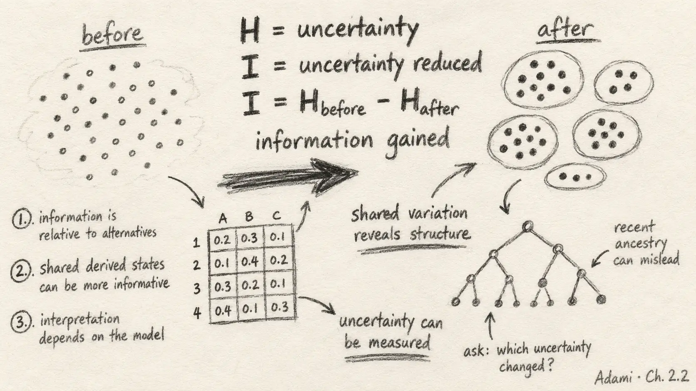

{.reading-sketch fig-alt="Handwritten pencil notes say that uncertainty can be measured, shared variation can reveal structure and recent ancestry can mislead."}

For the last two weeks I have been thinking about a counter-intuitive idea: uncertainty is not merely a defect in data. When it is measured carefully, its pattern can reveal biological organisation.

Sections 2.2 and 2.2.1 introduce entropy and information. The formulas matter, but the conceptual sequence matters more: first measure how uncertain a variable is; then ask how much that uncertainty decreases when another variable becomes known.

## Entropy: measuring what remains unpredictable

Shannon entropy is calculated from the probability distribution of a variable. If all states are equally likely, uncertainty is maximal. If one state occurs with certainty, entropy is zero. The base of the logarithm determines the unit: base two gives bits; other alphabets can use units scaled to their number of possible states.

I find it helpful to think of entropy as *potential information*. A variable with several plausible states has something left to reveal. A variable already known with certainty does not.

Applied to a sequence alignment, entropy can be measured at each site. Conserved positions have low entropy; highly variable positions have high entropy. In the tRNA alignment, this produces a landscape of constraint and variability across the molecule.

But low entropy is not automatically the same as biological importance. A site can appear conserved because the sampled sequences share a recent ancestor and have not had time to diverge. Sample composition and evolutionary history therefore shape the apparent signal.

## Information: uncertainty reduced by knowledge

The chapter defines mutual information as the reduction in uncertainty about one variable after another variable is known. This is a much stricter idea than calling a sequence “informative” because it looks complex.

The measure is symmetric: the shared dependence between two sites is the same whichever direction we describe it. Conditional entropy captures what remains unknown; mutual information captures what is shared.

In the tRNA example, calculating mutual information across every pair of sites creates a matrix. Strong off-diagonal patterns correspond to coordinated substitutions produced by base pairing. From sequence variation alone, the analysis begins to reveal RNA secondary structure.

This is beautiful because variability is doing the explanatory work. If paired sites never changed, there would be no covariation to detect. Structure becomes visible because evolution explores alternatives while selection preserves compatible combinations.

## The limitation that matters

The same example contains its own warning. The method needs a sufficiently diverse ensemble. If sequences are too closely related, most sites may look invariant whether or not they are functionally constrained. If the alignment contains uneven phylogenetic representation, shared ancestry can generate correlations that resemble functional coupling.

Information theory measures dependence in the supplied distribution. Biology must still explain how that distribution arose.

::: {.pencil-margin-note}
### Notes from my margin

- Entropy is not disorder in a vague sense; it is uncertainty under a stated model.
- Variation can reveal constraint when changes are coordinated.
- A clean pattern can still reflect sampling history rather than mechanism.
:::

## My interpretation for scientific AI

This reading helps me distinguish three quantities that are often blurred together: model confidence, statistical dependence and biological validity.

A language model can assign a sharp probability distribution, but calibration determines whether that confidence is trustworthy. A model score can correlate with an annotation, but dependence alone does not show causation. A benchmark can report strong discrimination, but biological validity depends on the target, controls, sampling and domain of use.

For PopGenLM Bench, entropy and information suggest useful evaluation questions. Does adding a model score reduce uncertainty about an independently measured outcome beyond simpler features such as conservation or GC content? Is that reduction stable across chromosomes, annotation classes and species? Does it remain after controlling for relatedness and genomic structure?

These questions are more demanding than plotting a score distribution. They are also more scientifically meaningful.

## Additional learning directions

I want to study finite-sample bias in entropy estimates, sequence reweighting, permutation-based null models and methods for higher-order interactions. Pairwise mutual information can detect relationships, but biological systems often involve networks of sites rather than isolated pairs.

I also want to compare mutual information with attention maps and learned representations from genomic foundation models. Similar-looking heat maps can arise from very different mathematical objects; comparison requires precise definitions and tests.

## My commentary

This was the section where information theory stopped feeling like an imported engineering language and began to feel biologically native. Evolution generates distributions. Selection, mutation and history shape their uncertainty. Relationships within those distributions can reveal organisation—but only when the ensemble and its history are taken seriously.

::: {.reading-source}
**Reading for this note:** Christoph Adami, *The Evolution of Biological Information*, Chapter 2, Sections 2.2 and 2.2.1 on entropy, conditional entropy, mutual information and the inference of tRNA structure from sequence covariation.
:::
