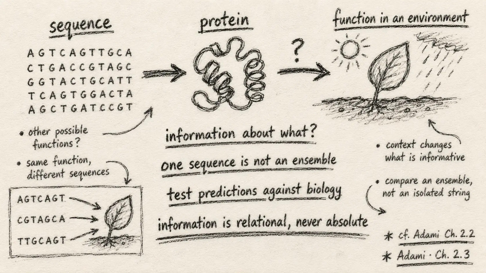

{.reading-sketch fig-alt="Handwritten pencil notes ask what information is about, emphasise ensembles and testing predictions against biology."}

The final part of the supplied excerpt asks a question that sounds almost poetic: what does a gene know? The chapter uses “know” in a precise, non-mental sense. A biological molecule has information about its world when its state supports successful predictions or interactions in that world.

This question brought the whole reading series together for me.

## Information is always about something

Section 2.3 turns from relationships within sequences to the information content of genes. A molecule such as haemoglobin is adapted to a world containing oxygen, particular chemical structures, cellular partners and physiological demands. Its sequence and folded form embody relationships accumulated through evolution.

Calling this “knowledge” is useful only if we remain precise. The molecule does not think. Its structure carries predictive relationships to an environment: what to bind, where to function, and which interactions to avoid.

This gives biological information a direction. A sequence is not simply full of information in the abstract. It may carry information about a molecular partner, an environment, a developmental state or a functional requirement.

## Why one sequence is not enough

Box 2.2 addresses a common difficulty. Shannon information is a correlational property of ensembles, so it cannot normally be measured by inspecting a single sequence. One observed string does not reveal which of its patterns are reliably connected to a target and which occurred by chance.

The distinction between a message and an ensemble is crucial. A particular clue may happen to predict correctly once, but its information can be assessed only across repeated possibilities. For molecular sequences, evolution helps generate the ensemble: mutation explores alternatives and selection changes which alternatives persist.

This is why conservation and covariation become informative. Across many sequences, the evolutionary process reveals which changes are tolerated and which relationships are maintained. The information is not printed visibly inside one string; it appears through structured variation across possible strings and worlds.

## Information content and biological complexity

The chapter suggests that information content may be a useful proxy for complexity, while acknowledging how difficult it is to estimate. Genes do not act alone. Regulatory systems store substantial context about when, where and how gene products are used. Protein-coding sequence is therefore only part of an organism's informational architecture.

The excerpt begins the discussion of proteins as amino-acid sequences translated from codons. Even at this early stage, the challenge is clear: counting possible symbols is not the same as measuring functional information. Function depends on folding, interactions, cellular context, environment and the ensemble of viable alternatives.

::: {.pencil-margin-note}
### Notes from my margin

- Information must have a target: information *about what*?
- A single sequence can be examined, but an ensemble is needed to measure a reliable relationship.
- Evolutionary history is part of the evidence, not background noise.
:::

## My interpretation for PopGenLM Bench

This reading changes the language I want to use around genomic AI. A model score is not “biological information” simply because it was produced from DNA. It becomes useful evidence only if it improves prediction of a clearly defined biological target in an appropriate ensemble.

For variant-effect models, possible targets include population frequency, evolutionary constraint, molecular function, expression, phenotype or experimental effect. These are related but not interchangeable. A score that predicts conservation may not predict present-day fitness in a particular population. A score calibrated in one species may not transfer to another. A correlation learned from sequence may reflect shared history rather than a causal mechanism.

PopGenLM Bench should therefore make four questions explicit:

1. What biological quantity is the score expected to predict?
2. Which ensemble defines the test—sites, individuals, populations or species?
3. How much uncertainty does the model reduce beyond appropriate baselines?
4. Under which changes of reference, lineage, annotation and sampling does that relationship remain stable?

This is a stronger foundation than asking whether the software ran or whether the plot looks convincing.

## My commentary on Chapter 2

The chapter's most important contribution, for me, is discipline of language. It moves from the history of genetic information to random variables, probability, entropy, conditional dependence and gene information without allowing “information” to remain a loose synonym for sequence.

I also appreciate that the biological examples expose the limits of the mathematics. An entropy profile depends on sampling. Mutual information detects dependence, not cause. A single sequence does not establish what it predicts. Recent ancestry can resemble constraint. These are not reasons to reject the framework; they are reasons to use it scientifically.

The reading has made my AI journey feel more grounded. The question is not whether AI can process more genomic data. It can. The harder question is whether its outputs carry stable, testable information about the biological world.

## Where I want to learn next

My next commentary series will return to the chapter topic by topic, with simple comparisons and small reproducible examples: entropy versus conservation, mutual information versus correlation, single sequences versus ensembles, and model likelihood versus biological effect.

I also want to extend the reading into information content in regulatory DNA, phylogeny-aware sequence models, calibration and the design of benchmarks that separate technical capability from biological support.

::: {.reading-source}
**Reading for this note:** Christoph Adami, *The Evolution of Biological Information*, Chapter 2, Section 2.3, Section 2.3.1 as included in the supplied excerpt, and Box 2.2, “Information in Single Sequences?”
:::
