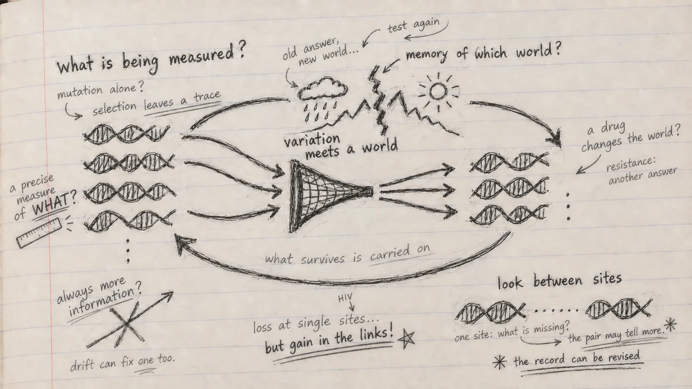

*A Genomes to AI reading note on Chapter 3 of Christoph Adami's* The Evolution of Biological Information.

I began this chapter expecting an account of how evolution adds information to DNA. Adami began with a ruler.

At first I wanted to hurry past it. What could the length of a stick have to do with the history of a genome? Then I realized that I had already made the assumption the example was meant to unsettle: that information simply sits in an object, waiting for us to read it out. A ruler tells me something about a stick because its markings respond to length. It may be precise and still tell me nothing about the stick's colour. The property, the measuring device and the question have to meet.

My first question in the margin was: **What is a genome measuring?**

Adami asks us to imagine a DNA sequence and the environment in which it evolves as two initially uncertain variables. Mutation offers possible changes; survival and reproduction test them in a particular world. If a variant repeatedly succeeds, inheritance can keep its sequence in a population. In the chapter's idealized example, an adaptive fixation makes a sequence state more predictable given the environment. Mutation alone has not learned anything. The relationship comes from variation, differential success and inheritance.

I had been picturing a genome as a store of answers. Now I pictured a *record of encounters*: a molecular possibility met a particular world, and descendants carried an outcome forward. “Memory” is a useful metaphor, provided I remember that there is no intention in the molecule and no foresight in selection.

## Why does the record last?

If molecules are physical, their records are vulnerable. Adami's Maxwell demon makes that problem tangible. The imaginary demon measures the motion of molecules and sorts them through a door. Sorting seems to create order for free until we count the physical record of the measurements and the cost of erasing it. Information has a material history.

Selection performs a different kind of sorting. A favourable change can spread; a damaging change may disappear with the lineages carrying it. Replication makes surviving arrangements available for another round. In Adami's deliberately clean picture, this can preserve information acquired in an environment against the noise that would otherwise erode it.

But I paused over the word *clean*. I work with population data; I cannot read a fixed difference as proof that selection discovered a better answer. Drift can fix variants. Populations are finite. Recombination reshuffles combinations. Organisms occupy different niches, and their neighbours evolve too. Adami makes room for these complications in his “leaky natural demon.” The leak matters: it prevents the metaphor from becoming a claim that information must rise with every generation.

It also changes the question. **Information about which world?**

## Does a conserved protein carry the same information everywhere?

Adami compares information profiles of homeodomain and COX2 proteins across branches of life. Their patterns do not trace one tidy staircase toward more information; the lineages separate in different ways. I returned to the ruler. The meaning of sequence constraint depends on what the protein does, where it does it, and which sequences I put in the comparison. An alignment can show me a pattern; it cannot alone tell me what caused it.

The chapter's ancestral protein example sharpens the distinction. Reconstructed fluorescent proteins from a coral lineage can be made and examined for their colours. Inferring a past sequence from a tree and testing a property of the resulting protein are different steps. A line on an entropy plot can start a question about a change in function; it cannot finish it.

## Can a good answer become wrong?

The lineage comparisons span deep time. Adami's HIV protease example brings environmental change into sharper focus. A protease inhibitor alters the world in which a viral protein must function. Viral populations that survive encounter a new selective pressure and explore new sequence combinations.

In comparisons of patient sequences, drug exposed proteases become more variable at particular residues than proteases from untreated patients. Count each residue separately and it looks as though information has been lost. That is a striking possibility: a population adapting to treatment may look less ordered when inspected one position at a time.

Then Adami asks where the information is being counted. In his time series, estimated single-site information falls in treated proteases while estimated dependencies between pairs of residues rise. Some associations join residues near the active site to others farther away. Adaptation may be distributed across combinations that a list of individual sites would miss.

I kept returning to a different question: **What if the unit I inspect is too small?**

This needs care. A correlation between residues does not establish its mechanism, and the chapter could not reliably estimate all higher-order dependencies. A rising sequence statistic is not proof that a virus has solved every problem posed by treatment. Yet the change between the single-site and pairwise views stays with me. At individual positions I might tell a story of loss; in their relationships I can see part of a possible reconstruction.

{.reading-sketch fig-alt="Graphite notebook drawing with a loop through variation, a changing environment, and inherited sequences. Handwritten notes question measurement, drift, HIV resistance and information between sites." fig-cap="My notebook after Chapter 3. The central loop replaces a crossed-out arrow of inevitable progress: variants encounter an environment, some are carried forward, and a changed world tests them again. The paired marks at the edge remind me why counting sites separately can miss a relationship. The ruler and drug notes are questions I want to keep asking, not a claim that every observed change is adaptive."}

## What if the interesting message lies outside the gene?

Adami then moves into regulatory DNA. A transcription factor must find suitable binding sites in a very long sequence. A motif can provide some of the specificity for that search. The chapter links the frequencies of nucleotides in binding sites to binding energy under a model, and asks how much specificity is *enough* to find targets among many alternatives in a genome.

Why should the strongest possible binding site always be best? Binding has to work within a regulatory system. A consensus motif is not necessarily the sequence we find in an organism. A weight matrix learned from known CRP sites can rank candidates, but a strict threshold misses some known sites while a loose one admits many others. A precise motif score cannot by itself tell me what happens in a cell.

The last example returned me to a thought from my earlier reading note: [meaning can live between things](../2026-02-07-meaning-lives-in-relationships/index.qmd). Dorsal binding sites involved in fly development differ depending on whether a Twist site is nearby. Separate the sites by that context and part of their sequence pattern becomes visible; pool them and the distinction blurs. Adami measures a modest association between the Dorsal sequence and the proximity of a Twist motif. For me, the discovery is not that DNA literally “knows” its neighbour. It is that my choice of comparison can hide a relationship useful for prediction.

That is why the little paired marks sit apart from the main loop in my drawing. The loop asks how a record changes through time; the marks ask where I am looking for that record. **The record can be revised, and some of it is in the connections.**

## From genomes to AI

This chapter gives me a more demanding way to think about genomic language models. A model can produce a reproducible score for a variant. That score may help predict a measured outcome. But it is not the same quantity as Adami's evolutionary information, and it cannot tell me on its own which aspect of biology the model has recovered. Does it track long-term constraint, a molecular assay, a change in binding, or fitness in a particular environment? These targets may disagree.

This is one reason I am building [PopGenLM Bench](../../popgenlm.qmd). I want to put variant scores beside independent evolutionary and functional evidence, state the genomic context, and test where agreement holds or breaks. The chapter also makes me uneasy about treating every variant as an isolated question. If function sometimes depends on combinations, neighbouring binding sites or environmental change, how much can any one variant score tell me without that context? This is a question for the benchmark to test, not a conclusion it has already established.

I closed the chapter with a changed version of my opening question. **What can a genome remember?** Relationships shaped by its history, to the extent that they persist and matter in a given context. **What can an AI model learn from that record?** Perhaps a great deal. But to find out *what* it has learned, I have to name a biological question and look for evidence beyond the score.

::: {.reading-source}
**Reading for this note:** Christoph Adami, *The Evolution of Biological Information* (2024), Chapter 3, “Evolution of Information,” §§3.1–3.5. The notebook questions and the connection to genomic AI are my interpretations of the chapter, not claims made by Adami or experimental findings from PopGenLM Bench.
:::
