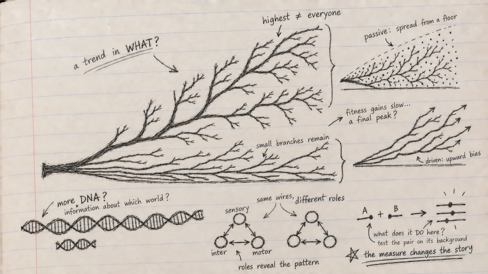

*A Genomes to AI reading note on Chapter 5 of Christoph Adami's* The Evolution of Biological Information.

In [my previous note](../2026-03-23-can-we-replay-evolution/index.qmd), the frozen ancestors in Lenski's experiment made me ask whether a new evolutionary path could be replayed. Chapter 5 asks a harder question about the paths we see across life: **if evolution produces complexity, what exactly is increasing?**

Adami begins with a tree of life. Its branches do not form a ladder. Bacteria and archaea have not been replaced by animals; they are still here, thriving in their own ways. A path from the root to a human can make it look as if evolution has been climbing toward us. Look at the whole tree, and the story changes. Before drawing an arrow marked *more complex*, I need to say what I counted and where I looked.

## Could I count the parts?

Different cell types, tissues and levels of organization give us one way to describe structure. But what level do I choose? One cell can contain intricate molecular machinery; a multicellular body can be divided into parts in several ways. Count the parts alone, and I miss their connections. Add the connections, and I still do not know what they *do*.

Perhaps genome length would give me a simpler answer. Every organism builds itself, in part, from genetic instructions. Yet the C-value paradox interrupts that thought: large genomes do not line up neatly with our sense of organismal complexity. Some organisms carry much more DNA than humans without fitting a simple ranking by structure or function. The extra sequence is still real; its length simply answers a different question.

I tried another word in the margin: *compressibility*. A repetitive sequence can be described briefly, while a random one resists compression. Kolmogorov complexity formalizes that distinction through the length of the shortest program that could produce a string. It is an elegant idea, but a random string can score highly without doing anything for an organism. Also, finding the shortest possible program is not generally computable. **Hard to compress is not the same as useful to a cell.**

Adami's move is to make the world part of the question. How much of a sequence is informative *given the environment in which it evolved*? In his account, physical or informational complexity is tied to what a sequence records about that environment. This is not a property I can read from a solitary DNA string. I need an ensemble of sequences, a specified environment and a way to compare them. And even then, the link between the theoretical construction and a measurable quantity requires assumptions.

The RNA aptamer experiments give that abstract idea something to hold onto. In one set of laboratory-evolved GTP-binding RNAs, stronger binding was associated with greater sequence information and, in the studied structures, more elaborate folding. This is a relationship within a defined molecular task, not a conversion rule that lets me rank every organism on one scale. A different task, or an environment that varies across a life cycle, changes what information may be useful. Adami even sketches an extension to multiple environments, while admitting how difficult it would be to measure in practice.

I wrote **“what does it do *here*?”** beside my first attempt at a universal ruler.

## Does the wiring tell me what the system does?

Chapter 5 then moves from sequences to networks. Genes help specify proteins and regulation; proteins participate in metabolic systems; neurons connect into circuits. A graph can show which parts are connected, but two graphs with the same bare pattern may have different meanings if the parts have different roles.

Adami uses an artificial cell model to make this testable. A small coded genome begins with a few metabolic functions and evolves larger networks. In the model, information measured in the genome grows alongside metabolic organization. The changing environment matters: a cell in a predictable world can rely on available precursors, whereas a cell facing fluctuating supplies may need machinery to make them. Bigger networks and higher information can emerge together in this model; it does not follow that every additional node in a living network improves function.

The worm *C. elegans* makes the limitation of a wiring diagram vivid. Count small patterns of connections between its neurons without identifying the neurons, and some patterns look unremarkable. Mark which nodes are sensory neurons, interneurons or motor neurons, and a sensory-to-interneuron-to-motor arrangement stands out against shuffled assignments. The connections stayed the same; the **roles** made a relationship visible. Adami also examines network modules and motif frequencies, while warning that neither modularity nor a motif count supplies a universal measure of complexity. How we label a node is itself a scientific choice.

That is what I wanted the two small networks in my notebook to remind me: **same wires, different roles.**

{.reading-sketch fig-alt="Graphite notebook sketch on ruled paper. A central tree retains low and high branches; two marginal sketches are labelled passive spread from a floor and driven upward bias. Side questions ask which world sequence information concerns, why node roles matter in a network, and how A and B act on the same background." fig-cap="My notebook after Chapter 5. The central branches keep diverse outcomes in view. The two small sketches distinguish a passive spread from a floor and an upward bias; neither establishes a universal trend in complexity. The lower notes ask about environmental information, node roles and genetic background. The question about slowing fitness gains concerns a single-lineage fitness trajectory, a different measure from organismal complexity."}

## If the upper branches rise, is evolution pushing them upward?

The tree led me to Adami's distinction between *passive* and *driven* trends. Imagine many lineages whose trait values wander up or down, but cannot go below a lower bound. As they branch and spread, the maximum can rise even when changes in either direction are equally likely. A driven trend requires evidence that increases are favored over decreases. **An increasing maximum by itself cannot tell me which process produced it.**

That distinction turns a vague claim about progress into a test. In fossil marine animals, body size has increased in ways that fit a size-biased model better than an unbiased one in the study Adami discusses. But body size is not complexity, and a result for one trait cannot be carried across the entire tree of life. He turns to proteins too: in a comparison grouped by inferred gene age, younger proteins tend to change faster, while older proteins are on average longer and more structurally ordered. Those are useful population-level patterns. They do not mean that every protein grows longer as it ages, or that any individual lineage must grow more complex.

Here I noticed a trap in my own question. *Does complexity increase?* has been quietly shifting between at least three things: the maximum among branches, a mean across groups, and the path taken by one lineage. These can behave differently even when all the observations are correct.

## What happens along one lineage?

To study shorter paths, Adami returns to fitness. In a deliberately restricted model with fixed fitness values, no mutation and selection acting on existing types, mean fitness rises as the fitter types spread. Fisher's theorem makes that result precise. Let mutations enter, and the simple guarantee no longer follows; Price's equation separates the part associated with selection from changes transmitted across generations. In a finite population, chance can also complicate the tidy upward path.

Lenski's evolving *E. coli* populations give this section an experimental anchor. Fitness improved substantially over tens of thousands of generations, yet the gains slowed. Adami examines the fitted trajectory and asks whether diminishing returns mean that adaptation is approaching a final summit. They do not, by themselves, establish one. An apparent peak in a two-dimensional landscape may conceal other accessible routes when many genes interact.

The NK model makes those interactions adjustable. Change how many positions affect one another, and the landscape becomes more or less rugged. Evolutionary runs can then take different routes; with some settings, a lineage can even pass through a lower-fitness state on its way to another peak. The model is intentionally small and controlled. It helps isolate what genetic interaction can do, without being a literal map of an *E. coli* genome.

This is where my question changes again. If mutation A helps on one background, will it help after mutation B? Epistasis means that the combined effect need not equal the effects of A and B treated independently. Even *diminishing returns* requires care: a slowing fitness trajectory and a particular sign of pairwise epistasis are not interchangeable statements. The route through sequence space changes what a later step can mean.

## From genomes to AI

I came to Chapter 5 with a genomic-model version of the same tempting shortcut: reduce a complex system to one number and compare the numbers. A language model can give each variant a precise score. But what would a score be a measure *of*? Sequence regularity, molecular function, long-term constraint, or a fitness effect in a particular environment? Those are distinct targets. A model trained to predict sequence can be excellent at that task without settling which variants matter for an organism.

This chapter suggests several questions for [PopGenLM Bench](../../popgenlm.qmd). Does model performance depend on the genomic context or the functional class being tested? Would a prediction change when a variant is placed on another haplotype? Do paired variants behave as the sum of their individual scores suggests? Does agreement with conservation persist in different environments or lineages? I have not established those answers. The benchmark needs independent evidence, appropriate controls and explicit comparison units to test them.

The most honest answer I can take from this chapter is a method of asking. **When does more become complexity?** When I specify *more of what*, in *which system*, under *which conditions*, and show why that measure speaks to the function or evolutionary process I care about. Adami does not close the book on a universal upward trend; his own chapter ends with that larger question open. My sketch therefore leaves the branches unfinished. Before I extend an arrow, I want to know what it measures.

::: {.reading-source}
**Reading for this note:** Christoph Adami, *The Evolution of Biological Information* (2024), Chapter 5, “Evolution of Complexity,” §§5.1–5.5. The claims about RNA aptamers, artificial metabolic networks, colored neuronal motifs, fossil body size, protein age, the LTEE and NK landscapes follow examples discussed there. The notebook questions and the connection to genomic AI are my interpretations, not results from PopGenLM Bench.
:::
