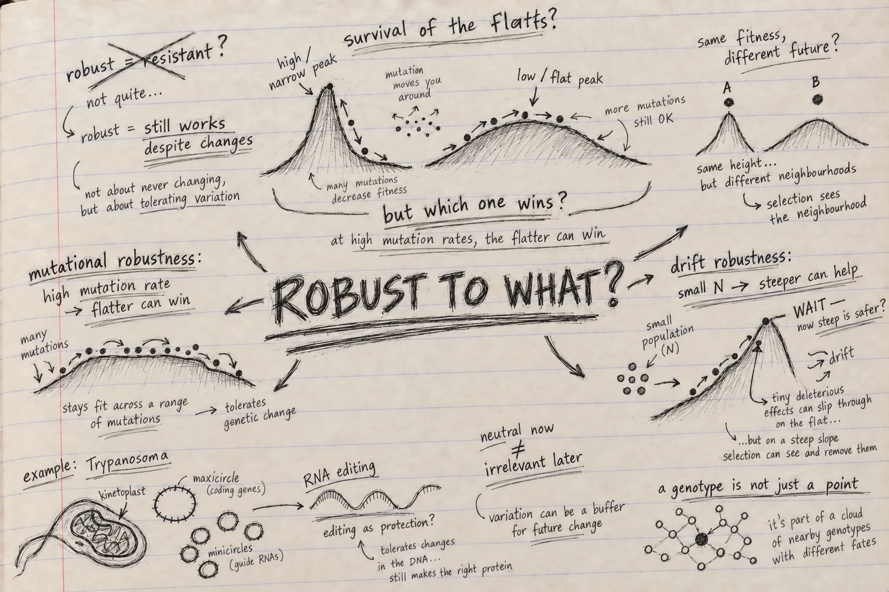

*Reading Christoph Adami, **The Evolution of Biological Information**, Chapter 6.*

{fig-alt="Graphite notebook sketch of neutral networks, fitness peaks, mutation, genetic drift and kinetoplast RNA editing, surrounded by handwritten questions."}

I thought I knew what *robustness* meant before starting this chapter.

Something changes. The organism absorbs the disturbance. Life goes on.

Simple enough.

But fairly early in Chapter 6 I realised that Adami was asking something much stranger.

What if evolution can change not only the organism, but also **what happens when the organism is changed**?

I kept returning to that thought.

A genome is constantly being copied. Mutations appear. Alleles are lost by chance. Population size changes how efficiently selection can distinguish one effect from another.

So perhaps surviving well is not only about occupying a good genotype.

Perhaps it is also about living in a **good neighbourhood of possible genotypes**.

That was the point where this chapter opened up for me.

## Neutral — but neutral in what sense?

The chapter begins with Kimura and neutral evolution.

The result itself is one I already knew from population genetics: a new neutral mutation has a fixation probability of roughly \(1/N\), while roughly \(N\nu\) neutral mutations arise, so the population-level substitution rate becomes approximately \(\nu\).

Population size disappears from the final expression.

Beautiful.

But this time another question bothered me more:

**If a mutation does not change fitness, does that really mean it does nothing?**

My instinctive answer had always been: for selection, essentially yes.

Then I realised how much is hidden inside the words *does not change fitness*.

We have measured the organism carrying the mutation.

We have not yet asked what happens to its descendants when **another mutation** occurs.

That is a very different question.

A change can therefore be neutral with respect to the organism standing in front of us and still alter the consequences of mutations that have not happened yet.

I wrote beside this:

> **neutral now ≠ irrelevant later**

And suddenly neutrality no longer looked like empty evolutionary space.

It looked like hidden architecture.

## I had been drawing genomes as points

This was probably my strongest shift while reading the chapter.

We routinely draw fitness landscapes as peaks and valleys and place a genotype somewhere on them.

One genotype. One point. One fitness.

But a replicating genome never really exists as an isolated point.

Every replication creates the possibility of moving somewhere nearby.

One nucleotide away.

One mutation away.

Then another.

So I started thinking less about the height of the point and more about the shape of the ground around it.

Imagine two genotypes with almost the same present fitness.

Around the first, most single mutations are damaging.

Around the second, many mutations produce sequences that still work.

If I only measure the two organisms today, they may appear equally successful.

But their futures are not equivalent.

One stands on brittle ground.

The other stands on something more forgiving.

That felt like an important change in perspective:

**perhaps selection sometimes acts on the neighbourhood, not merely the point.**

## Then came the phrase that sounds almost wrong

**Survival of the flattest.**

The first time you encounter it, it almost feels like a contradiction inserted deliberately into evolutionary biology.

Surely the highest fitness peak should win.

That is practically the picture we teach.

But now imagine that the peak is very narrow.

Its summit is excellent, but almost every mutational step away from it is disastrous.

Nearby is another peak.

Lower.

Less impressive.

But broad.

Mutations around it usually still leave functioning descendants.

At a sufficiently high mutation rate, I can no longer judge these populations only by the fitness of their best genotype.

The population constantly leaks into neighbouring sequence space.

And once I saw it that way, the contradiction disappeared.

The lower peak can win because evolution is not comparing two isolated sequences.

It is comparing two **mutating populations**.

That was one of those moments where a familiar diagram suddenly means something different.

I could almost hear myself objecting:

*But the other genotype is fitter.*

And the answer coming back:

**Fitter as what? A sequence—or as a lineage that must repeatedly reproduce under mutation?**

That distinction stayed with me.

## Robustness does not even mean making every mutation harmless

Then the chapter did something I did not expect.

My intuition was that mutational robustness should always mean turning damaging mutations into milder ones.

Bad mutation → less bad mutation → neutral mutation.

That seems obvious.

Except it is not the only possibility.

A mildly deleterious mutation can survive.

It can reproduce.

It can become somebody else's starting point.

A lethal mutation cannot.

So under some circumstances, if a deleterious change cannot be made harmless, making it **lethal rather than weakly damaging** can actually protect the lineage from carrying that damage forward.

I stopped at this because it felt almost backwards.

Robustness through lethality?

Yet the logic is remarkably clean.

The important question is not simply:

**How severe is the mutation?**

It is also:

**Can its consequences propagate?**

That changed what the word *robustness* meant for me.

Robustness is not necessarily gentleness.

Sometimes it is containment.

## And then population size changed the answer again

At this point I thought I had the chapter's logic.

High mutation pressure can favour flatter regions of a fitness landscape.

Good.

Then came drift robustness.

And my neat picture broke again.

In a small population, selection loses resolution.

A mutation with a tiny deleterious effect may technically reduce fitness, but if that effect is smaller than the noise created by genetic drift, selection may be unable to remove it reliably.

Such mutations can become effectively neutral.

One can fix.

Then another.

Then another.

The problem is no longer simply mutation.

It is the gradual, stochastic loss of information that selection is too weak to prevent.

I found myself asking:

**If flatness protects against mutation, shouldn't flatness also protect a small population?**

No.

And this was probably my favourite conceptual reversal in the chapter.

For drift, a shallow fitness effect can be precisely the problem.

If a mutation is only slightly harmful, drift can carry it across the population.

But if epistasis makes that mutation strongly deleterious, selection can suddenly see it again.

So protection from drift can require something closer to a **steeper** local landscape.

I drew the two possibilities beside each other:

**high mutation rate → flatter can be safer**

**small population → steeper can be safer**

For a moment they look contradictory.

Then the real question appears:

**Robust to what?**

That, for me, is the centre of Chapter 6.

There is no universally robust genome.

There is only robustness relative to a particular source of evolutionary danger.

## Same genome. Different evolutionary physics.

Mutation and drift are both sources of change.

But they threaten populations differently.

Mutation continually generates new variants.

Drift determines which variants may survive or disappear simply because populations are finite.

So the architecture that protects a lineage against one kind of uncertainty need not protect it against the other.

That sounds obvious after saying it.

It did not feel obvious before reaching this chapter.

And it made me think again about something population geneticists routinely do: we talk about a variant's effect as though that effect were a complete evolutionary description.

But the fate of that effect depends on mutation rate, population size, genetic background, epistasis and the surrounding fitness landscape.

A mutation does not arrive in a vacuum.

Neither does selection.

## Then Adami takes us to one of biology's strangest genomes

The *Trypanosoma* section made the abstract argument feel much less abstract.

Kinetoplastid mitochondria are extraordinary.

Their mitochondrial DNA is divided between maxicircles and enormous numbers of minicircles. Many mitochondrial transcripts are not ready to translate directly from the encoded DNA. Guide RNAs direct extensive RNA editing before functional messages emerge.

The system looks, at first sight, unnecessarily complicated.

Why would evolution tolerate such machinery?

This is precisely where the robustness perspective becomes provocative.

If mutations in important mitochondrial sequences disrupt the editing cascade, many damaging changes can become effectively lethal rather than being allowed to accumulate gradually.

Other sequences can gain protection through overlap or multifunctionality.

And the guide-RNA population itself can maintain a relatively stable collective distribution even though individual sequence variants turn over.

I found myself staring again at the same question:

**Is this complexity merely something evolution became stuck with—or is part of it doing evolutionary work that is invisible if I inspect only present-day fitness?**

Adami contrasts this interpretation with constructive neutral evolution.

That distinction matters.

One explanation asks how elaborate machinery can accumulate without being directly favoured.

The robustness argument asks something different:

**What does that machinery do to the future consequences of mutation and drift?**

It may be almost invisible when nothing goes wrong.

Its importance appears when perturbation arrives.

And that thought immediately reminded me of engineering.

The value of redundancy, error correction or a backup system is often invisible while everything is functioning normally.

You discover what it was doing only when the system is challenged.

## This is where I suddenly thought about genomic AI

Until this point I had been reading Chapter 6 as an evolutionary biologist.

Then I started seeing language-model scores everywhere.

A genomic language model gives us something very tempting:

one sequence → one score.

Change one nucleotide → another score.

We can ask whether the alternative allele looks more or less plausible than the reference.

Useful.

But after this chapter, that feels incomplete.

Suppose two sequences receive almost identical model scores.

Now mutate every position around each sequence.

For the first sequence, almost every neighbour receives a much worse score.

For the second, dozens of neighbouring sequences remain perfectly plausible.

Are those two sequences really equivalent?

The original scores say yes.

Their **local landscapes** say no.

And suddenly the connection to robustness becomes hard to ignore.

Perhaps genomic models should not only be evaluated by asking:

**Did the model score this variant correctly?**

Perhaps we should also ask:

**What landscape has the model learned around this sequence?**

Is it sharp?

Flat?

Asymmetric?

Are there connected neutral-like regions?

Do the model's tolerated sequence neighbourhoods correspond to evolutionary conservation, allele frequencies or experimentally measured mutational tolerance?

And perhaps most importantly:

**does the biological meaning of that landscape change with population context?**

A model may identify molecular constraint beautifully and still know nothing about effective population size.

It may recognize a highly constrained nucleotide without knowing whether a weakly deleterious allele is visible to selection in the population where it occurs.

That is not necessarily a failure of the model.

But it is a limitation of what its score means.

And distinguishing those two things matters.

## Maybe a variant is the wrong unit of thought

This chapter left me wondering whether our obsession with individual variant scores is partly inherited from the structure of our datasets.

Variant.

Position.

Reference.

Alternative.

Score.

Next row.

But evolution does not read a VCF one row at a time.

A mutation appears inside a genome.

That genome has neighbours.

Those neighbours have neighbours.

Their effects interact.

And the whole system is filtered through mutation, selection, drift and population history.

So perhaps a genuinely evolutionary genomic AI should eventually tell us something larger than:

> this mutation looks bad.

I would want to know:

> **What kind of evolutionary neighbourhood am I standing in?**

That feels like a much richer question.

And perhaps a much harder benchmark.

## The sentence I am carrying out of Chapter 6

If Chapter 5 made me suspicious of the word *complexity*, Chapter 6 has made me suspicious of the word *fitness* when it appears alone.

A genotype can have high fitness and still be fragile.

A genotype can sacrifice some immediate fitness and make its lineage safer under mutation.

A mutation can be neutral now and profoundly alter the effects of mutations that come later.

And a small population can favour a genetic architecture very different from the one favoured under high mutation pressure.

So evolution is doing something subtler than climbing toward better sequences.

It is also reshaping the consequences of where the next step might land.

That is the idea I did not have when I began the chapter.

And it may be the most useful one I am taking with me toward genomic AI:

**a genome is not just a sequence. It occupies a neighbourhood of possibilities.**

If our models truly understand something about biological sequence, perhaps we should eventually expect them to recover not only the score of the sequence in front of us—

but the shape of that neighbourhood around it.
