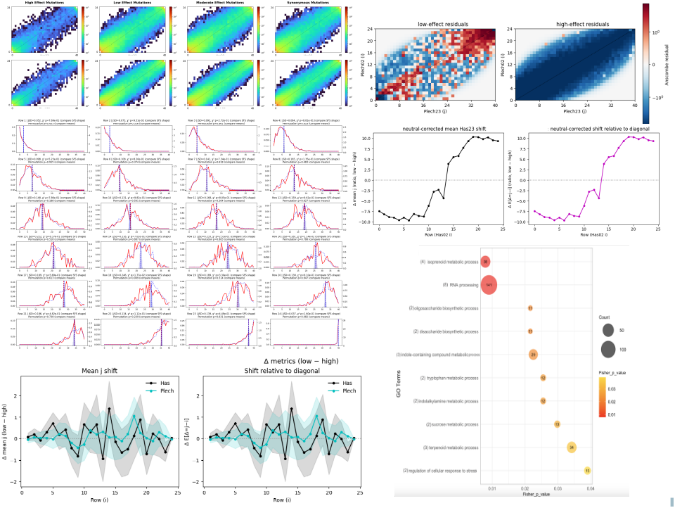
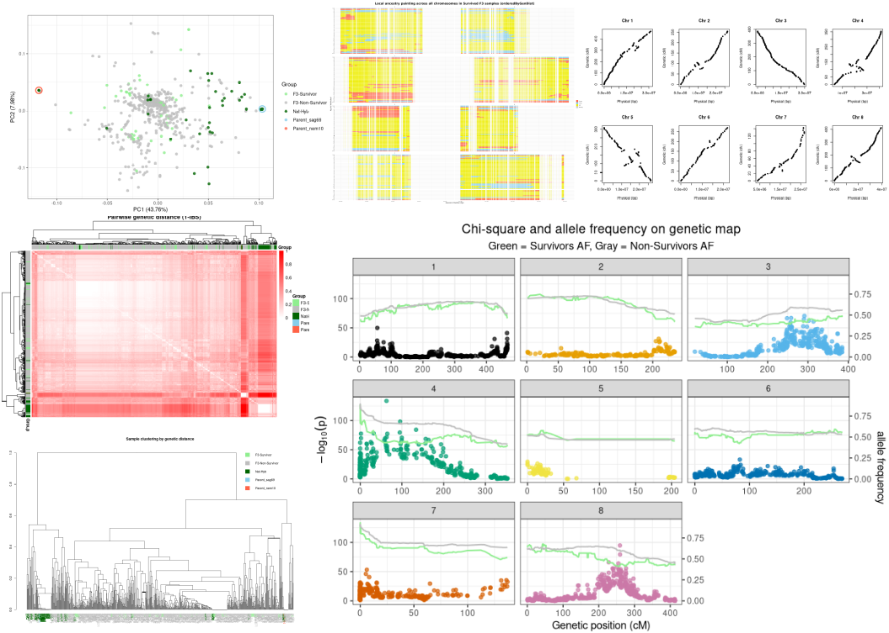
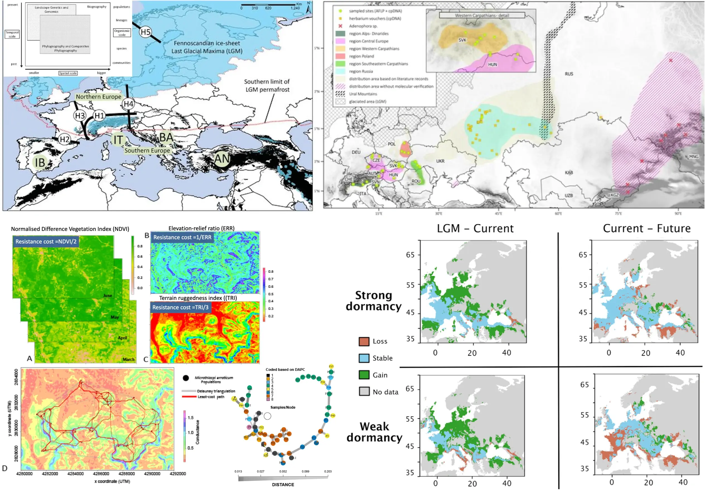
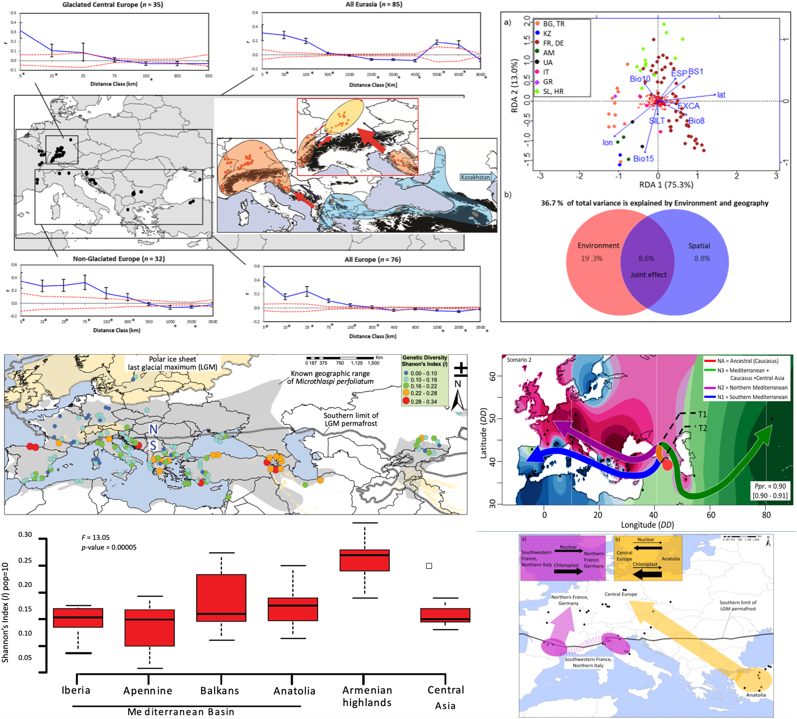
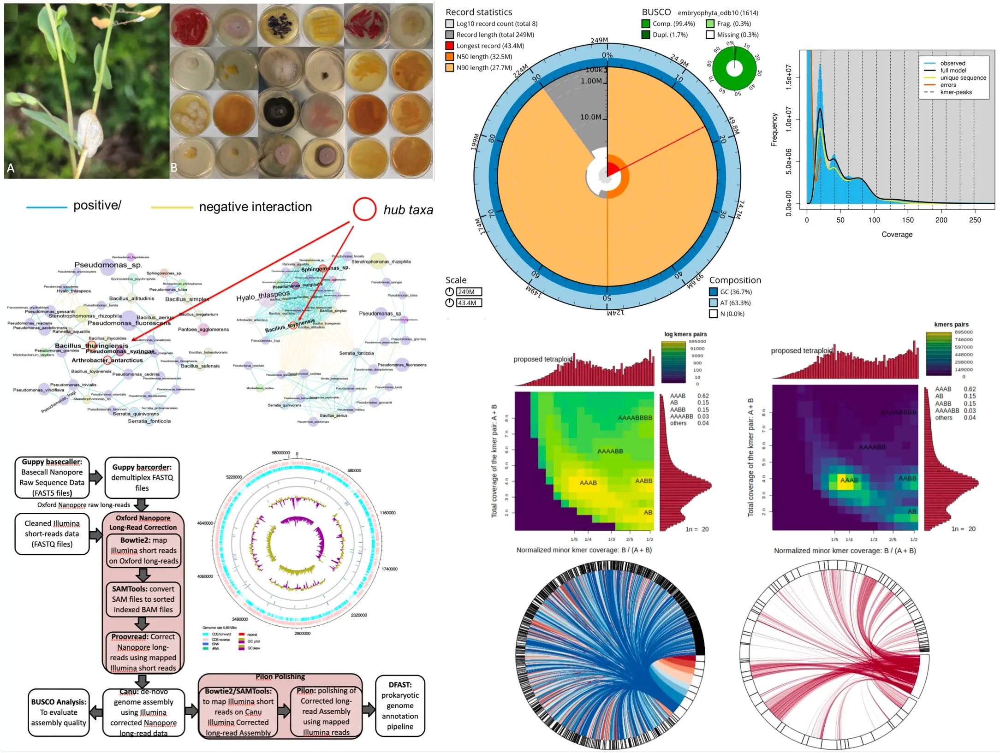
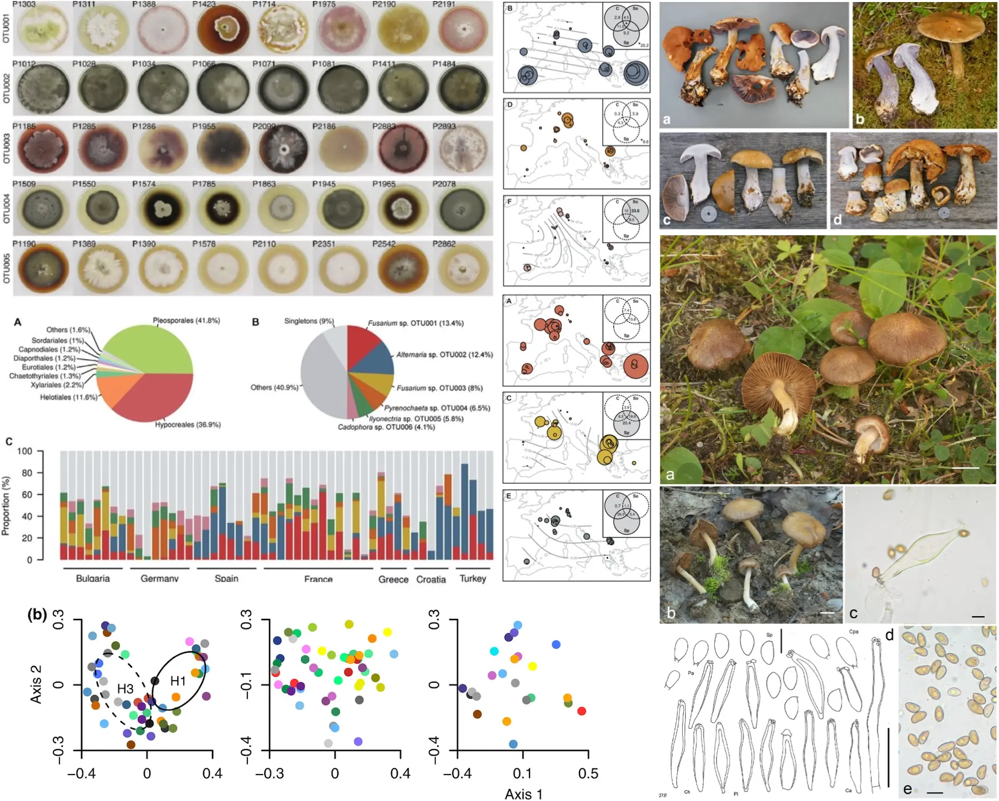
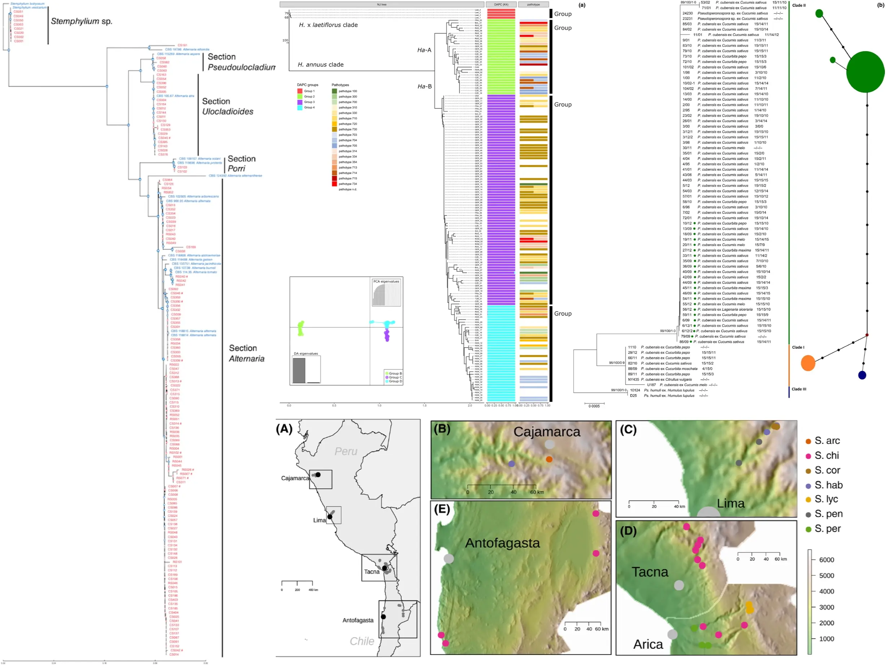
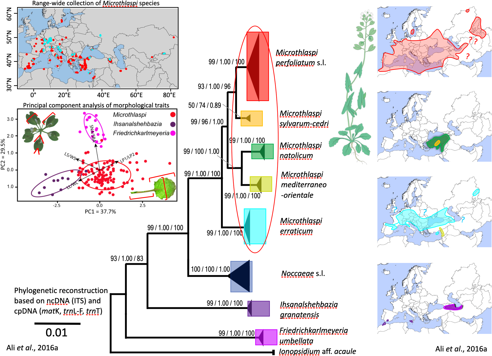

<p class="lead">Research and software projects connecting genome variation, evolutionary processes, ecological change, biodiversity, and reproducible scientific computation.</p>

<div class="project-nav" aria-label="Project index">
  <a href="#popgenlm-project">PopGenLM Bench</a>
  <a href="#assembling-genomes">High-resolution genomics</a>
  <a href="#hybridisation-genomics">Hybridisation</a>
  <a href="#temporal-genomics">Temporal genomics</a>
  <a href="#plant-adaptation">Climate adaptation</a>
  <a href="#systematics">Systematics</a>
  <a href="#phylogeography">Phylogeography</a>
  <a href="#fungal-diversity">Fungal diversity</a>
  <a href="#pathogen-evolution">Pathogen evolution</a>
</div>

## Featured scientific AI project

```{=html}
<section class="project-feature" id="popgenlm-project">
  <div>
    <div class="card-kicker">Open-source scientific AI · verified v0.1 foundation</div>
    <h2>PopGenLM Bench</h2>
    <p>A reproducible evaluation framework for testing whether genomic language-model variant scores are technically valid and biologically consistent with population-genetic and evolutionary evidence.</p>
    <p>The project connects model inference with reference validation, provenance, allele frequency, conservation, genomic annotation, effect sizes, uncertainty, and explicit interpretation boundaries.</p>
    <div class="tag-row"><span class="tag">Python</span><span class="tag">GPN</span><span class="tag">Variant scoring</span><span class="tag">Population genomics</span><span class="tag">Reproducibility</span></div>
    <div class="card-actions">
      <a class="button-primary" href="popgenlm.html">Explore project</a>
      <a class="button-secondary" href="https://colab.research.google.com/github/tahirali-biomics/tahirali-biomics.github.io/blob/main/notebooks/popgenlm-bench-demo.ipynb">Run Colab analysis</a>
    </div>
  </div>
  
</section>
```

## Evolutionary and population genomics

<p class="section-intro">How drift, selection, gene flow, demographic history, and environmental change shape genetic variation across time and space.</p>

```{=html}
<div class="project-showcase">
  <article class="project-entry" id="temporal-genomics">
    <div class="project-media"></div>
    <div class="project-card-body">
      <div class="card-kicker">Current research</div>
      <h3>Temporal genomics</h3>
      <p>Temporal genomics detects evolutionary change directly by tracking allele-frequency shifts across generations. Repeated sampling of natural <em>Arabidopsis lyrata</em> populations, separated by approximately two decades, makes it possible to quantify recent genomic change and compare observed shifts with neutral expectations.</p>
      <p>Genome-wide analyses examine how much change is consistent with drift, which loci exceed demographic expectations, and whether candidate regions show coherent relationships with environmental trends, functional annotation, or genomic constraint. The broader aim is to understand how standing genetic variation, demography, and selection jointly shape evolutionary responses to rapid environmental change.</p>
      <div class="tag-row"><span class="tag">Temporal data</span><span class="tag">Genetic drift</span><span class="tag">Selection</span><span class="tag">Genomic constraint</span><span class="tag">Climate change</span></div>
    </div>
  </article>

  <article class="project-entry reverse" id="hybridisation-genomics">
    <div class="project-media"></div>
    <div class="project-card-body">
      <div class="card-kicker">Current research</div>
      <h3>Hybridisation genomics</h3>
      <p>Hybridisation generates new genetic combinations, can facilitate adaptation, and may contribute to the formation or collapse of species boundaries. This work investigates hybridisation in <em>Arabis</em> and related Brassicaceae by combining high-throughput sequencing, experimental crosses, field studies, and phenotyping.</p>
      <p>Patterns of introgression, ancestry dynamics, segregation distortion, and the architecture of reproductive barriers are used to ask why some genomic regions cross species boundaries while others are retained or removed. Comparative work across experimental and natural hybrid systems provides insight into gene flow, adaptation, and diversification under changing environments.</p>
      <div class="tag-row"><span class="tag">Introgression</span><span class="tag">Gene flow</span><span class="tag">Reproductive barriers</span><span class="tag">Experimental crosses</span></div>
    </div>
  </article>

  <article class="project-entry" id="plant-adaptation">
    <div class="project-media"></div>
    <div class="project-card-body">
      <div class="card-kicker">Published research</div>
      <h3>Climate adaptation and seed dormancy</h3>
      <p>This research examines plant responses to past and present climate change through phylogeography, landscape genetics, and adaptive seed dormancy. Molecular, ecological, and spatial analyses reveal how Quaternary climate oscillations, glacial refugia, recolonisation, and habitat fragmentation have shaped present-day diversity and species distributions.</p>
      <p>Experimental studies in <em>Arabidopsis thaliana</em> investigate heat-induced secondary dormancy as an adaptive mechanism that adjusts germination timing to environmental conditions. Together, these lines of work connect historical range dynamics with contemporary trait evolution and help clarify how plants persist under environmental variability.</p>
      <div class="tag-row"><span class="tag">Local adaptation</span><span class="tag">Seed dormancy</span><span class="tag">Landscape genetics</span><span class="tag">Climate response</span></div>
    </div>
  </article>

  <article class="project-entry reverse" id="phylogeography">
    <div class="project-media"></div>
    <div class="project-card-body">
      <div class="card-kicker">Published research</div>
      <h3>Phylogeography of <em>Microthlaspi</em></h3>
      <p>Range-wide sampling and population-genetic analyses reconstruct the evolutionary history, migration, and genetic structure of <em>Microthlaspi</em> across Eurasia and North Africa. AFLP and sequence data show how climatic heterogeneity, selfing, and fragmented distributions have shaped genetic diversity.</p>
      <p>The work revealed that <em>M. erraticum</em> extends from the Alps into Central Asia, while <em>M. perfoliatum</em> survived in multiple Pleistocene refugia and recolonised Europe through complex routes. Central Europe emerged as a contact zone among divergent lineages, illustrating how climate, geography, and historical demography combine to structure present-day biodiversity.</p>
      <div class="tag-row"><span class="tag">Range dynamics</span><span class="tag">Historical demography</span><span class="tag">Pleistocene refugia</span><span class="tag">Migration</span></div>
    </div>
  </article>
</div>
```

## Genome resources and biological interactions

<p class="section-intro">Genome assembly, plant-associated communities, and pathogen evolution across host and environmental contexts.</p>

```{=html}
<div class="project-showcase">
  <article class="project-entry" id="assembling-genomes">
    <div class="project-media"></div>
    <div class="project-card-body">
      <div class="card-kicker">Current research</div>
      <h3>High-resolution genomics of plant-microbe systems</h3>
      <p>This work develops high-quality, chromosome-level genome assemblies for Brassicaceae species and genomic resources for associated phyllosphere bacterial communities. PacBio HiFi, Oxford Nanopore, Hi-C, and Illumina data are integrated to resolve genome structure, gene content, and assembly quality in both host plants and key bacterial hub taxa.</p>
      <p>The resulting resources support comparative genomics, functional-gene discovery, and investigations of plant-microbe interactions. They also provide a reliable genomic foundation for downstream population, evolutionary, and community analyses.</p>
      <div class="tag-row"><span class="tag">Genome assembly</span><span class="tag">PacBio HiFi</span><span class="tag">Oxford Nanopore</span><span class="tag">Hi-C</span><span class="tag">Phyllosphere</span></div>
    </div>
  </article>

  <article class="project-entry reverse" id="fungal-diversity">
    <div class="project-media"></div>
    <div class="project-card-body">
      <div class="card-kicker">Published research</div>
      <h3>Fungal diversity, systematics, and communities</h3>
      <p>Phylogenetic and morphological analyses clarify fungal diversity in forest and plant-associated systems. Taxonomic work on <em>Cortinarius</em> sect. <em>Riederi</em> and <em>Inocybe</em> subgenus <em>Inocybe</em> resolved overlooked lineages, complex synonymies, and previously unrecognised species.</p>
      <p>Community-level research examines root endophytic fungi in non-mycorrhizal <em>Microthlaspi</em>. Large-scale sampling and multilocus data indicate that a small number of dominant fungal groups are widespread across Europe, with environmental gradients contributing more strongly to community structure than host genotype or simple geographic distance.</p>
      <div class="tag-row"><span class="tag">Fungal systematics</span><span class="tag">Endophytes</span><span class="tag">Community ecology</span><span class="tag">Environmental filtering</span></div>
    </div>
  </article>

  <article class="project-entry" id="pathogen-evolution">
    <div class="project-media"></div>
    <div class="project-card-body">
      <div class="card-kicker">Published research</div>
      <h3>Emergence and evolution of downy mildew pathogens</h3>
      <p>Field surveillance, molecular phylogenetics, and population genetics are used to study the emergence and spread of downy mildew pathogens affecting ornamental and crop plants in Europe. Work on <em>Peronospora aquilegiicola</em> documented its rapid movement from East Asia into Britain and Germany and evaluated the risk to cultivated and native <em>Aquilegia</em>.</p>
      <p>Complementary studies of <em>Pseudoperonospora cubensis</em> and <em>Plasmopara halstedii</em> revealed changes in virulence, host range, lineage structure, and patterns consistent with multiple introductions or host-associated differentiation. These systems show how pathogen evolution, trade, host availability, and dispersal interact to create new agricultural and biodiversity risks.</p>
      <div class="tag-row"><span class="tag">Disease emergence</span><span class="tag">Population structure</span><span class="tag">Host range</span><span class="tag">Pathogen surveillance</span></div>
    </div>
  </article>
</div>
```

## Systematics and biodiversity

```{=html}
<div class="project-showcase">
  <article class="project-entry" id="systematics">
    <div class="project-media"></div>
    <div class="project-card-body">
      <div class="card-kicker">Published research</div>
      <h3>Systematics of <em>Microthlaspi</em> and Coluteocarpeae</h3>
      <p>This project addresses longstanding taxonomic problems in the Brassicaceae tribe Coluteocarpeae, with particular emphasis on <em>Microthlaspi</em> and related genera. Nuclear and chloroplast phylogenies, combined with critical morphological study, clarified relationships among major lineages and supported revised generic boundaries.</p>
      <p>The integrative approach revealed cryptic diversity, enabled the recognition and description of new taxa, and produced taxonomic treatments, distribution information, and diagnostic evidence for future research. It demonstrates why molecular data and careful morphological reassessment are most powerful when interpreted together.</p>
      <div class="tag-row"><span class="tag">Phylogenetics</span><span class="tag">Taxonomy</span><span class="tag">Species discovery</span><span class="tag">Morphology</span></div>
    </div>
  </article>
</div>
```

<div class="project-closing">
  <div><div class="card-kicker">Research record</div><h3>Publications and professional experience</h3><p>Peer-reviewed articles, preprints, manuscripts, teaching, and research roles spanning evolutionary genomics, plant adaptation, phylogeography, systematics, fungal biology, and pathogen evolution.</p></div>
  <div class="card-actions"><a class="button-primary" href="publications.html">View publications</a><a class="button-secondary" href="cv.html">View résumé</a></div>
</div>
