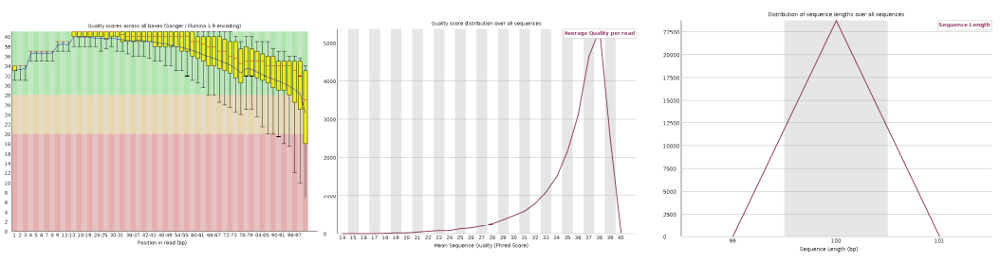
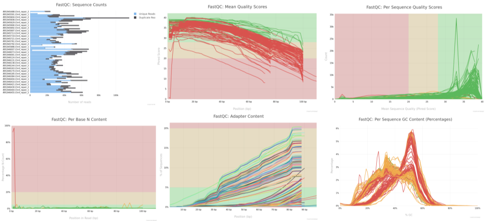
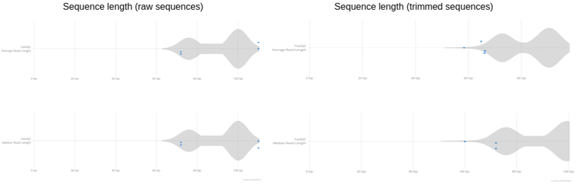

# Learning Objectives

-   Access the HPC (using MobaXterm on Windows or Terminal on Mac/Linux).
-   Explore raw FASTQ read files and understand the structure of FASTQ data.
-   Install new tools, set environment variables, or load pre-installed tools on the HPC system.
-   Check the quality of FASTQ reads using tools like FASTQC and interpret the output statistics.
-   Trim FASTQ reads to remove adapters or low-quality bases using appropriate tools.
-   Write a script (bash/python, etc.) to automate workflows, such as running commands on multiple files in a for loop, and submit jobs to an HPC system using SLURM SBATCH scheduling.

------------------------------------------------------------------------

## Tools to be Used

-   **FASTQC / MULTIQC:** For quality control of FASTQ reads.
-   **Trimmomatic / fastp:** For read trimming.
-   **BWA:** For mapping reads to a reference genome.
-   **SAMTOOLS:** For conversion of SAM to BAM files.
-   **QUALIMAP:** For quality control of BAM files.

------------------------------------------------------------------------

# Connecting to HPC (RAMSES) and Organizing the Workspace

## Connect to the HPC

For Windows users: Use MobaXterm. For Mac/Linux users: Use the Terminal application.\
Log in to the HPC cluster using your login credentials.

``` bash
ssh -Y qbius030@@ramses1.itcc.uni-koeln.de
# Replace 'qbius030' with your specific username.
# Enter passphrase for key '/Users/tahirali/.ssh/ramses_key', if prompted:
# Duo two-factor login for qbius030
```

**Check Your Current Directory**

``` bash
pwd
```

-   If you are not in your home directory, navigate to it:

``` bash
cd /home/group.kurse/qbius030/
# Replace 'qbius030' with your specific username.
```

**Copy Raw Data to Your Home Directory**

``` bash
cp -r /scratch/tali/Practical_Day_1/sample_project_data .
```

**Create a Directory for Analysis**

``` bash
mkdir -p Practical_Day_1/{fastqc,trimming,mapping,bamqc}
```

-   **fastqc**: for storing quality control results of fastq files.
-   **trimming**: for storing trimmed read files.
-   **mapping**: for storing read mapping outputs.
-   **bamqc**: for storing quality control results of bam files.

# Instructions for Running Bioinformatics Jobs on the HPC (RAMSES)

For quality control and downstream processing of FASTQ files,\
we will execute various tasks on the HPC using Bash scripts with for loops.

**Steps:**

1.  Prepare your script using a text editor and save it as `your_bash_script.sh`.

2.  Submit your job in the terminal using:

``` bash
sbatch your_bash_script.sh
```

3.  For more details, consult the [RAMSES Brief Instructions](https://gitlab.git.nrw/uzk-itcc-hpc/itcc-hpc-ramses/-/wikis/Documentation).

# Examine FASTQ Files and Evaluate Sequencing Quality

## Exploring Contents of FASTQ File

**Navigate to the location of the raw FASTQ files:**

``` bash
cd /home/group.kurse/qbius030/sample_project_data/fastq
```

**Example 1:** View the first 8 lines of a FASTQ file to examine its structure.

``` bash
zcat SRR1945488.Chr4_repair_1.fastq.gz | head -n 8
```

**Example 2:** Count the number of reads in a compressed FASTQ file.

``` bash
zcat SRR1945488.Chr4_repair_1.fastq.gz | wc -l
# Divide by 4 to get the number of reads.
```

**Example 3:** Print the second line of each read (sequence line) from a compressed FASTQ file.

``` bash
zcat SRR1945488.Chr4_repair_1.fastq.gz | awk 'NR % 4 == 2 {print;}' | less
```

**Example 4:** Print the first 10 sequences (second line of each read) from a compressed FASTQ file.

``` bash
zcat SRR1945488.Chr4_repair_1.fastq.gz | awk 'NR % 4 == 2 {print;}' | head -n 10
```

## Quality Control of Raw FASTQ Reads Using FastQC

**Check if required module is installed:**

``` bash
module avail
```

**Example SLURM script for FastQC Analysis**

``` bash
#!/bin/bash -l

#SBATCH --job-name=fastqc
#SBATCH --nodes=1
#SBATCH --ntasks-per-node=8
#SBATCH --mem=10gb
#SBATCH --time=01:00:00
#SBATCH --account=UniKoeln
#SBATCH --output=/home/group.kurse/qbius030/Practical_Day_1/fastqc/fastqc_repair.out
#SBATCH --error=/home/group.kurse/qbius030/Practical_Day_1/fastqc/fastqc_repair.err

module load bio/FastQC

INPUT_DIR="/home/group.kurse/qbius030/sample_project_data/fastq"
OUTPUT_DIR="/home/group.kurse/qbius030/Practical_Day_1/fastqc"
mkdir -p $OUTPUT_DIR

for FILE in $INPUT_DIR/*Chr4_repair_1.fastq.gz $INPUT_DIR/*Chr4_repair_2.fastq.gz; do
    fastqc -o $OUTPUT_DIR "$FILE"
done
```

**Fixing the “DOS Line Breaks” Error on a HPC Cluster**

-   If you see:

``` bash
sbatch: error: Batch script contains DOS line breaks (\r\n)
```

**Fix with:**

``` bash
dos2unix fastqc.sh
cat -v fastqc.sh  # Check for ^M characters
```

**Check job status:**

``` bash
squeue -u qbius030
```

View HTML output in browser: Open the .html file with a web browser (adjust the path as needed):

``` bash
firefox SRR1945488.Chr4_repair_paired_2_fastqc.html
```

 **Figure: FastQC per-base quality plot**

## Summarize FastQC Results with MultiQC

``` bash
module load bio/MultiQC/
cd fastqc
multiqc .
```

 **Figure: MultiQC Summary (after running MultiQC on FastQC results)**

# Quality trimming of raw FASTQ reads using Trimmomatic

**Check if required module is installed:**

``` bash
module avail
```

**Example SLURM script for FASTQ trimming:**

``` bash
#!/bin/bash -l

#SBATCH --job-name=trimming
#SBATCH --nodes=1
#SBATCH --ntasks-per-node=8
#SBATCH --mem=10gb
#SBATCH --time=01:00:00
#SBATCH --account=UniKoeln
#SBATCH --output=/home/group.kurse/qbius030/Practical_Day_1/trimming/fastqc_trim.out
#SBATCH --error=/home/group.kurse/qbius030/Practical_Day_1/trimming/fastqc_trim.err

module load bio/Trimmomatic/

INPUT_DIR="/home/group.kurse/qbius030/sample_project_data"
OUTPUT_DIR="/home/group.kurse/qbius030/Practical_Day_1/trimming"
ADAPTERS="/home/group.kurse/qbius030/sample_project_data/adapters/Illumina_PE.fa"
mkdir -p $OUTPUT_DIR

for FORWARD_FILE in ${INPUT_DIR}/*.Chr4_repair_1.fastq.gz; do
  REVERSE_FILE="${FORWARD_FILE/_1.fastq.gz/_2.fastq.gz}"
  BASE_NAME=$(basename $FORWARD_FILE _1.fastq.gz)
  FORWARD_PAIRED="${OUTPUT_DIR}/${BASE_NAME}_paired_1.fastq.gz"
  FORWARD_UNPAIRED="${OUTPUT_DIR}/${BASE_NAME}_unpaired_1.fastq.gz"
  REVERSE_PAIRED="${OUTPUT_DIR}/${BASE_NAME}_paired_2.fastq.gz"
  REVERSE_UNPAIRED="${OUTPUT_DIR}/${BASE_NAME}_unpaired_2.fastq.gz"

  java -jar $EBROOTTRIMMOMATIC/trimmomatic-0.39.jar PE \
    -threads 4 \
    $FORWARD_FILE \
    $REVERSE_FILE \
    $FORWARD_PAIRED \
    $FORWARD_UNPAIRED \
    $REVERSE_PAIRED \
    $REVERSE_UNPAIRED \
    ILLUMINACLIP:${ADAPTERS}:2:30:10 \
    LEADING:3 \
    TRAILING:3 \
    SLIDINGWINDOW:4:15 \
    MINLEN:36
done
```

**Compare Raw vs. Trimmed Reads with FastQC and MultiQC**

\
**Figure: plot showing read length distribution before and after trimming.** ------------------------------------------------------------------------

# Mapping to reference using BWA + SAMtools

**Check if required module is installed:**

``` bash
module avail
```

**Example SLURM script for Mapping:**

``` bash
#!/bin/bash -l

#SBATCH --job-name=mapping
#SBATCH --nodes=1
#SBATCH --ntasks-per-node=8
#SBATCH --mem=10gb
#SBATCH --time=01:00:00
#SBATCH --account=UniKoeln
#SBATCH --output=/home/group.kurse/qbius030/Practical_Day_1/mapping/bwa_mapping.out
#SBATCH --error=/home/group.kurse/qbius030/Practical_Day_1/mapping/bwa_mapping.err

module purge
module load bio/BWA/0.7.18-GCCcore-12.3.0
module load bio/SAMtools/1.18-GCC-12.3.0

INPUT_DIR="/home/group.kurse/qbius030/Practical_Day_1/trimming"
OUTPUT_DIR="/home/group.kurse/qbius030/Practical_Day_1/mapping"
REFERENCE="/home/group.kurse/qbius030/sample_project_data/reference_data/Arabidopsis_thaliana.TAIR10.dna.chromosome.4_98K.fasta"

# bwa index $REFERENCE  # Uncomment if not already indexed

for FORWARD_FILE in ${INPUT_DIR}/*_paired_1.fastq.gz; do
  REVERSE_FILE="${FORWARD_FILE/_paired_1.fastq.gz/_paired_2.fastq.gz}"
  BASE_NAME=$(basename $FORWARD_FILE _paired_1.fastq.gz)
  SAM_FILE="${OUTPUT_DIR}/${BASE_NAME}.sam"
  BAM_FILE="${OUTPUT_DIR}/${BASE_NAME}.bam"
  SORTED_BAM="${OUTPUT_DIR}/${BASE_NAME}.sorted.bam"
  
  bwa mem -M -t 20 $REFERENCE $FORWARD_FILE $REVERSE_FILE > $SAM_FILE
  samtools view -bS $SAM_FILE > $BAM_FILE
  samtools sort -@ 20 $BAM_FILE -o $SORTED_BAM
  samtools index $SORTED_BAM
  rm $SAM_FILE
  rm $BAM_FILE
done
```

## Plot: Mapping Quality Distribution

```{.r}
# Load required packages
suppressPackageStartupMessages({
  library(Rsamtools)
  library(ggplot2)
  library(dplyr)
})

# Set working directory to BAM folder
setwd("/home/tahirali/RAMSES_mount/tali/qbio/Practical_Day_1/mapping")

# Get list of all BAM files in the directory
bam_files <- list.files(pattern = "\\.bam$", full.names = TRUE)

# Function to extract MAPQ from BAM
get_mapq <- function(bamfile) {
  param <- ScanBamParam(what = "mapq")
  aln <- scanBam(bamfile, param = param)[[1]]
  data.frame(MAPQ = aln$mapq, Sample = basename(bamfile))
}

# Extract MAPQ for all BAMs
mapq_list <- lapply(bam_files, get_mapq)
mapq_df <- bind_rows(mapq_list)

# Clean: remove NA
mapq_df <- mapq_df %>% filter(!is.na(MAPQ), MAPQ >= 0)

# Density plot across BAMs
ggplot(mapq_df, aes(x = MAPQ, color = Sample)) +
  geom_density(size = 0.7, alpha = 0.5) +
  theme_bw() +
  theme(
    plot.title = element_text(hjust = 0.5),   # center title
    legend.position = "none"
  ) +
  labs(
    title = "Mapping Quality Distribution across BAMs",
    x = "MAPQ score", y = "Density"
  )

# line plot of MAPQ counts per BAM

mapq_summary <- mapq_df %>%
  group_by(Sample, MAPQ) %>%
  summarise(Count = n(), .groups = "drop")

ggplot(mapq_summary, aes(x = MAPQ, y = Count, color = Sample)) +
  geom_line(alpha = 0.7) +
  theme_bw() +
  theme(
    plot.title = element_text(hjust = 0.5),   # center title
    legend.position = "none"
  ) +
  labs(
    title = "Mapping Quality (per BAM)",
    x = "MAPQ", y = "Read count"
  )

# Summarise mapping quality categories per BAM
mapq_stats <- mapq_df %>%
  group_by(Sample) %>%
  summarise(
    Total_Reads = n(),
    MAPQ_0 = sum(MAPQ == 0),
    MAPQ_40 = sum(MAPQ == 40),
    MAPQ_60 = sum(MAPQ == 60),
    High_Quality = sum(MAPQ >= 30),
    .groups = "drop"
  ) %>%
  mutate(
    Pct_MAPQ_0 = round(100 * MAPQ_0 / Total_Reads, 2),
    Pct_MAPQ_40 = round(100 * MAPQ_40 / Total_Reads, 2),
    Pct_MAPQ_60 = round(100 * MAPQ_60 / Total_Reads, 2),
    Pct_HighQ  = round(100 * High_Quality / Total_Reads, 2)
  )

mapq_stats

# Overall summary across all BAMs
mapq_overall <- mapq_df %>%
  summarise(
    Total_Reads = n(),
    MAPQ_0 = sum(MAPQ == 0),
    MAPQ_40 = sum(MAPQ == 40),
    MAPQ_60 = sum(MAPQ == 60),
    High_Quality = sum(MAPQ >= 30)
  ) %>%
  mutate(
    Pct_MAPQ_0 = round(100 * MAPQ_0 / Total_Reads, 2),
    Pct_MAPQ_40 = round(100 * MAPQ_40 / Total_Reads, 2),
    Pct_MAPQ_60 = round(100 * MAPQ_60 / Total_Reads, 2),
    Pct_HighQ  = round(100 * High_Quality / Total_Reads, 2)
  )

mapq_overall
```

# Run and Configure Qualimap for BAMQC Analysis

**Check if required module is installed:**

``` bash
module avail bio/ | grep qualimap
```

-   If available, load it:

``` bash
module load bio/qualimap/<version>
```

-   If not available, download and install Qualimap locally:

``` bash
cd /home/group.kurse/qbius030/tools/
wget https://bitbucket.org/kokonech/qualimap/downloads/qualimap_v2.3.zip
unzip qualimap_v2.3.zip
echo 'export PATH="/home/group.kurse/qbius030/tools/qualimap_v2.3:$PATH"' >> ~/.bashrc
source ~/.bashrc
```

**Try running Qualimap:**

``` bash
qualimap
```

-   If you see this error: **Unrecognized VM option 'MaxPermSize=1024m' Error: Could not create the Java Virtual Machine.**

-   Edit the Qualimap launch script:

``` bash
nano /home/group.kurse/qbius030/tools/qualimap_v2.3/qualimap
```

-   Press Ctrl+W and search for MaxPermSize
-   Find the line: **java_options="-Xms32m -Xmx\$JAVA_MEM_SIZE -XX:MaxPermSize=1024m"**
-   Change it to: **java_options="-Xms32m -Xmx\$JAVA_MEM_SIZE" - Save (Ctrl+O, Enter) and exit (Ctrl+X)**

**Set Up R Environment for Plotting with Qualimap**

``` bash
mkdir -p ~/R_libs
echo '.libPaths("/home/group.kurse/qbius030/R_libs/")' >> ~/.Rprofile
```

**In R:**

```{.r}
.libPaths()
my_lib <- "/run/media/tahirali/2a4efc98-aaa3-4a01-a063-37db1463f3a8/tools/anaconda/envs/quarto-env/lib/R/library"

cran_pkgs <- c("optparse", "XML")
bioc_pkgs <- c("NOISeq", "Rsamtools", "Repitools", "rtracklayer")

is_installed <- function(pkg, lib) {
  pkg %in% rownames(installed.packages(lib.loc = lib))
}

# Set CRAN mirror only for CRAN packages
options(repos = c(CRAN = "https://cloud.r-project.org"))
for (pkg in cran_pkgs) {
  if (!is_installed(pkg, my_lib)) {
    install.packages(pkg, lib = my_lib)
  }
}

# Do NOT set options(repos=...) before BiocManager::install()
if (!is_installed("BiocManager", my_lib)) {
  install.packages("BiocManager", lib = my_lib)
}
BiocManager::install(version = "3.20")

for (pkg in bioc_pkgs) {
  if (!is_installed(pkg, my_lib)) {
    BiocManager::install(pkg, lib = my_lib)
  }
}
```

**Example SLURM Script for BAMQC Analysis**

``` bash
#!/bin/bash -l

#SBATCH --job-name=bamqc
#SBATCH --time=1:00:00
#SBATCH --cpus-per-task=4
#SBATCH --mem=16gb
#SBATCH --account=UniKoeln
#SBATCH --output=/home/group.kurse/qbius030/Practical_Day_1/bamqc/bamqc.out
#SBATCH --error=/home/group.kurse/qbius030/Practical_Day_1/bamqc/bamqc.err

BAM_DIR="/home/group.kurse/qbius030/Practical_Day_1/mapping"
BAMQC_DIR="/home/group.kurse/qbius030/Practical_Day_1/bamqc"
MULTIBAMQC_DIR="$BAMQC_DIR/multibamqc"

mkdir -p "$BAMQC_DIR" "$MULTIBAMQC_DIR"

# Run Qualimap BAMQC for each sorted BAM file
for BAM_FILE in "$BAM_DIR"/*.sorted.bam; do
  SAMPLE_NAME=$(basename "$BAM_FILE" .sorted.bam)
  QUALIMAP_OUTPUT_DIR="$BAMQC_DIR/$SAMPLE_NAME"
  echo "Running Qualimap BAMQC for $SAMPLE_NAME"
  qualimap bamqc \
    -bam "$BAM_FILE" \
    -outdir "$QUALIMAP_OUTPUT_DIR" \
    -outformat HTML \
    -outfile "${SAMPLE_NAME}_report"
done

# Prepare input groups file for multi-bamqc
INPUT_GROUPS_FILE="$BAMQC_DIR/input_groups.txt"
rm -f "$INPUT_GROUPS_FILE"

echo "Creating input groups file for Multi-BAMQC"
for BAMQC_OUTPUT_DIR in "$BAMQC_DIR"/*; do
  if [ -d "$BAMQC_OUTPUT_DIR" ] && [ -f "$BAMQC_OUTPUT_DIR/genome_results.txt" ]; then
    SAMPLE_NAME=$(basename "$BAMQC_OUTPUT_DIR")
    echo -e "${SAMPLE_NAME}\t${BAMQC_OUTPUT_DIR}\t1" >> "$INPUT_GROUPS_FILE"
  fi
done

# Run Qualimap Multi-BAMQC
echo "Running Qualimap Multi-BAMQC"
qualimap multi-bamqc \
  -d "$INPUT_GROUPS_FILE" \
  -outdir "$MULTIBAMQC_DIR" \
  -outformat PDF

echo "Qualimap analysis complete. Reports saved in $MULTIBAMQC_DIR."
```

**View results using Firefox:**

``` bash
cd /home/group.kurse/qbius030/Practical_Day_1/bamqc/multibamqc
firefox report.pdf
```

**Use MultiQC to Summarize Qualimap QC of All Samples**

``` bash
#!/bin/bash -l
#SBATCH --job-name=multiqc
#SBATCH --time=1:00:00
#SBATCH --cpus-per-task=4
#SBATCH --mem=16gb
#SBATCH --account=UniKoeln
#SBATCH --output=/home/group.kurse/qbius030/Practical_Day_1/bamqc/bamqc.out
#SBATCH --error=/home/group.kurse/qbius030/Practical_Day_1/bamqc/bamqc.err

module purge
module load bio/MultiQC/1.22.3-foss-2023b

BAMQC_DIR="/home/group.kurse/qbius030/Practical_Day_1/bamqc"
MULTIBAMQC_DIR="$BAMQC_DIR/multiqc_report"
mkdir -p "${MULTIBAMQC_DIR}"

echo "====================================================="
echo "Running MultiQC on Qualimap BAM QC results..."
echo "Output Directory: ${MULTIBAMQC_DIR}"
echo "====================================================="

multiqc "${BAMQC_DIR}" -o "${MULTIBAMQC_DIR}"

echo "MultiQC report generated in: ${MULTIBAMQC_DIR}"
```

\
**Figure: Qualimap coverage plot.**

------------------------------------------------------------------------
**Wrapping Up Practical Day One**

Thank you for your active participation today! 🎉\
Great job on tackling today’s challenges—we hope you found it engaging and insightful.\
See you next week for more exciting learning and discoveries! Keep practicing and exploring until then! 🚀
